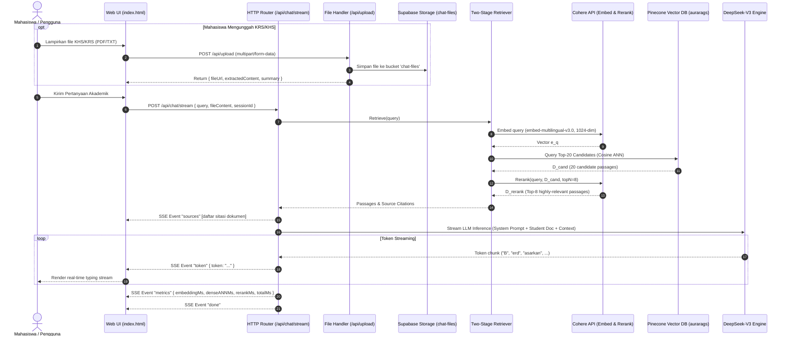

# 📄 DOKUMEN SERAH TERIMA TEKNIS (HANDOVER SPECIFICATION)
## Proyek: AURA UII (Academic Universal Regulatory Assistant)
**Disiapkan untuk:** Hermes Agent (Foreman/Architect: Claude Opus 4 Thinking | Worker: Claude Sonnet 4)  
**Standar Kerangka Kerja:** Everything Claude Code (ECC) & Superpowers (v6.3.0)  
**Tanggal Rilis Dokumen:** 17 September 2026  
**Status Sistem:** Production-Ready MVP (Pure Go Native Two-Stage RAG)

---

## 1. 📌 EXECUTIVE SUMMARY & DOMAIN CONTEXT

### 1.1. Profil Proyek & Visi
* **Nama Proyek:** AURA UII (*Academic Universal Regulatory Assistant*)
* **Visi Aplikasi:** Sistem asistensi kecerdasan buatan berbasis *Two-Stage Retrieval-Augmented Generation* (RAG) dan DPA (*Dosen Pembimbing Akademik*) Virtual yang dirancang untuk menavigasi regulasi institusional perguruan tinggi yang tersebar, tebal, dan berbahasa hukum formal.
* **Institusi Afiliasi:** Jurusan Teknik Informatika, Fakultas Teknologi Industri (FTI), Universitas Islam Indonesia (UII), Yogyakarta.
* **Target Pengguna:** Mahasiswa aktif, dosen pembimbing akademik (DPA), dosen pembimbing skripsi, dan staf Divisi Administrasi Akademik (DAA/Tata Usaha).

### 1.2. Core Value Proposition
1. **Nol-Halusinasi (*Zero-Hallucination Grounding*):** Menolak secara tegas menjawab klausul yang tidak termuat dalam basis pengetahuan resmi universitas; melampirkan sitasi eksplisit (misal: `[Pedoman FTI Pasal 2]`).
2. **Dual-Context Adaptive Advisory (DPA Virtual):** Mengawinkan **Konteks Dokumen Pribadi Mahasiswa** (lembar KRS, KHS, transkrip nilai semester) dengan **Basis Regulasi Institusional** untuk menghasilkan evaluasi prasyarat kelayakan studi dan rekomendasi strategi pengambilan mata kuliah.
3. **High-Performance Native Engineering:** Berpindah 100% dari orkestrasi no-code (n8n/Docker) ke arsitektur **Pure Golang Native Orchestration**, menghasilkan latensi inferensi sub-detik, konkurensi tinggi, dan jejak memori minimal.

### 1.3. Aturan Domain Kunci (Institutional Compliance Rules)
* **Prasyarat Seminar Proposal (Sempro) Skripsi (Pedoman FTI Pasal 2):**
  - Minimal **110 SKS lulus**.
  - **Nol nilai E** pada seluruh riwayat studi.
  - IPK kumulatif minimal **2.00**.
  - Telah lulus mata kuliah Metodologi Penelitian minimal nilai **C**.
  - Draf proposal telah disetujui & ditandatangani Dosen Pembimbing Skripsi.
* **Masa Berlaku SK Pembimbing Skripsi (Pedoman FTI Pasal 7):**
  - Berlaku **6 (enam) bulan** sejak tanggal terbit dekanat.
  - Perpanjangan maksimal 1 kali (durasi 6 bulan berikutnya) dengan syarat menyertakan *logbook* bimbingan.
* **Batas Toleransi Plagiarisme Turnitin (Pedoman FTI Pasal 12):**
  - *Similarity Index* maksimal **20%** (dengan *exclude bibliography* dan *exclude quotes*).
* **Prasyarat Yudisium Sarjana (Pedoman FTI Pasal 18):**
  - Total kelulusan minimal **144 SKS**, IPK $\ge 2.00$.
  - Akumulasi nilai **D tidak melebihi 10%** dari total SKS kumulatif ($14.4\text{ SKS}$).
  - Nol nilai E, lulus Ujian Skripsi, sertifikat kemahiran bahasa Inggris (CEPT/TOEFL CILACS UII $\ge 450$), dan sertifikasi hafalan Al-Qur'an DPPAI UII.
* **Beban Kredit SKS Semester Berdasarkan IPS (Pedoman Akademik UII Pasal 10):**
  - $\text{IPS} \ge 3.00 \implies \text{Maksimal } 24\text{ SKS}$
  - $2.50 \le \text{IPS} \le 2.99 \implies \text{Maksimal } 21\text{ SKS}$
  - $2.00 \le \text{IPS} \le 2.49 \implies \text{Maksimal } 18\text{ SKS}$
  - $1.50 \le \text{IPS} \le 1.99 \implies \text{Maksimal } 15\text{ SKS}$
  - $\text{IPS} < 1.50 \implies \text{Maksimal } 12\text{ SKS}$
* **Batas Masa Studi & Sanksi Drop Out (Pedoman Akademik UII Pasal 22):**
  - Evaluasi Semester 4: Minimal 35 SKS lulus, IPK $\ge 2.00$.
  - Evaluasi Semester 8: Minimal 80 SKS lulus, IPK $\ge 2.00$.
  - Batas maksimal studi S1: 14 semester (7 tahun).

---

## 2. 🛠️ TECH STACK & RUNTIME PREREQUISITES

### 2.1. Bahasa & Lingkungan Runtime
* **Primary Language:** Go (Golang) version `go1.27.1 darwin/arm64` (Minimum requirement: `go1.22+`).
* **HTTP Routing:** Native Go 1.22+ `http.ServeMux` (path-based routing tanpa framework bloated).
* **Concurrency Model:** Goroutines, Channels, sync.RWMutex, dan non-blocking Server-Sent Events (SSE).
* **Frontend Web Stack:** Standalone Vanilla JS + Tailwind CSS (CDN) + Marked.js (Markdown renderer).

### 2.2. Layanan Pihak Ketiga & Integrasi Eksternal
1. **LLM Inference Engine:** DeepSeek-V3 (`https://api.deepseek.com`, model `deepseek-chat`).
2. **Dense Vector Embeddings:** Cohere API (`embed-multilingual-v3.0`, dimensi padat $D = 1024$).
3. **Neural Cross-Encoder Reranker:** Cohere API (`rerank-v3.5`, model pemeringkat ulang silang-penyandi).
4. **Vector Database:** Pinecone Serverless (Cloud: AWS, Region: `us-east-1`, Metric: `cosine`, Dimension: `1024`, Index: `aurarags`).
5. **Document Layout & Web Reader:** Jina Reader API (`https://r.jina.ai`, ekstraksi PDF/Web ke Markdown bersih).
6. **Relational DB & Object Storage:** Supabase (Project: `fwvywtrtrykphttthaib.supabase.co`, Storage bucket: `chat-files`).

### 2.3. Template Aman Variabel Lingkungan (`aura-core/.env`)
```env
# Server Runtime
PORT=8090
ENV=development

# DeepSeek LLM (Generation & Anti-Hallucination Reasoning)
DEEPSEEK_API_KEY=sk-placeholder-deepseek-key
DEEPSEEK_BASE_URL=https://api.deepseek.com
DEEPSEEK_MODEL=deepseek-chat

# Cohere (Stage-1 Embedding 1024-dim & Stage-2 Cross-Encoder Reranking)
COHERE_API_KEY=cohere-placeholder-api-key
COHERE_EMBED_MODEL=embed-multilingual-v3.0
COHERE_RERANK_MODEL=rerank-v3.5

# Jina Reader (Document PDF/Web Markdown Extractor)
JINA_API_KEY=jina-placeholder-api-key
JINA_READER_BASE_URL=https://r.jina.ai

# Pinecone Vector Database (Vector Storage & Top-K ANN Retrieval)
PINECONE_API_KEY=pcsk_placeholder_pinecone_key
PINECONE_INDEX=aurarags
PINECONE_HOST=https://aurarags-r3mz0ei.svc.aped-4627-b74a.pinecone.io

# Supabase (Storage & Relational Database)
SUPABASE_URL=https://fwvywtrtrykphttthaib.supabase.co
SUPABASE_ANON_KEY=eyJhbGciOiJIUzI1NiIsInR5cCI6IkpXVCJ9...placeholder
```

---

## 3. 🗺️ REPOSITORY MAP & ARCHITECTURE BOUNDARIES

### 3.1. Struktur Direktori Proyek
```
/Users/hanifadam/AURAUII/
├── HANDOVER.md                # [DOKUMEN INI] Panduan serah terima komprehensif untuk Hermes
├── PAPER_SCOPUS.md            # Naskah ilmiah Scopus/ICITDA sistem AURA
├── aura-core/                 # ⭐ [DIREKTORI PRODUKSI UTAMA - PURE GOLANG ENGINE]
│   ├── go.mod                 # Module: aurauii/aura-core
│   ├── .env                   # Kredensial aktif (Gitignored)
│   ├── .env.example           # Template kredensial publik
│   ├── bin/
│   │   ├── aura-core          # Executable server utama (Port 8090)
│   │   └── aura-ingest        # Executable CLI batch ingestion
│   ├── cmd/
│   │   ├── server/main.go     # Web server entrypoint, graceful shutdown, handler wiring
│   │   ├── ingest/main.go     # CLI batch ingesti dokumen PDF lokal/Supabase
│   │   └── seed/main.go       # Seeder korpus kanonikal regulasi FTI UII ke Pinecone
│   ├── pkg/                   # Lapisan Klien Pihak Ketiga (Independen & Reusable)
│   │   ├── jina/client.go     # Client Jina Reader API
│   │   ├── cohere/client.go   # Client Cohere Embeddings & Reranker
│   │   ├── pinecone/client.go # Client Pinecone REST Data Plane (Query & Upsert)
│   │   ├── deepseek/client.go # Client DeepSeek (Complete & SSE Stream)
│   │   ├── chunker/splitter.go# Recursive Character Splitter murni algoritma Go
│   │   └── supabase/client.go # Client Supabase REST DB & Storage Upload
│   ├── internal/              # Lapisan Domain Internal & Bisnis Logika
│   │   ├── config/config.go   # Environment loader & validator
│   │   ├── models/models.go   # Domain structs, ChatRequest/Response, Metrics
│   │   ├── rag/
│   │   │   ├── ingestor.go    # Alur Ingesti: Jina -> Chunker -> Cohere -> Pinecone
│   │   │   ├── retriever.go   # Alur Temu Balik 2-Tahap: Dense ANN Top-20 -> Rerank Top-8
│   │   │   └── generator.go   # Alur Penalaran Grounded + DPA Virtual + SSE Stream
│   │   └── api/
│   │       ├── handlers.go    # REST handlers: /api/health, /api/chat, /api/chat/stream
│   │       ├── upload_handler.go # Handler unggah berkas KHS/KRS & regulasi baru
│   │       └── router.go      # HTTP ServeMux, middleware CORS, static file server
│   └── web/                   # Antarmuka Pengguna Frontend
│       └── templates/index.html # Web UI: Chat, File Preview, SSE, Modal Regulasi
├── internal/                  # [LEGACY ARSIP] Implementasi proxy Go server lama
├── n8n-backend/               # [LEGACY ARSIP] Docker compose n8n & PostgreSQL
└── n8nessentials/             # [LEGACY ARSIP] File JSON workflow n8n 001A & 001B
```

### 3.2. Siklus Hidup Permintaan (*Request Lifecycle*)


### 3.3. Batasan Desain & Konvensi Kode
1. **Aturan Isolasi Paket:** Modul `pkg/` dilarang keras mengimpor paket dari `internal/` (kecuali domain data transfer models jika esensial) agar reusable dan mudah di-unit-test.
2. **Immutability & Concurrency:** Semua klien API di `pkg/` harus *thread-safe* untuk pemanggilan konkuren goroutine. Penggunaan muteks (`sync.RWMutex`) wajib pada manipulasi state bersama (seperti dynamic host discovery di `pkg/pinecone`).
3. **Batas Ukuran File:** Mengikuti standar ECC, usahakan ukuran file tidak melebihi **400 baris kode**. Jika membesar, lakukan dekomposisi modular.

---

## 4. 🧪 TESTING & TDD SPECIFICATIONS

### 4.1. Framework Pengujian
* **Test Runner:** Standar Go test toolchain (`go test`).
* **Perintah Pengujian:**
  ```bash
  cd /Users/hanifadam/AURAUII/aura-core
  go test ./... -v
  ```
* **Coverage Command:**
  ```bash
  go test -coverprofile=coverage.out ./... && go tool cover -func=coverage.out
  ```

### 4.2. Status Pengujian Saat Ini
* **Hasil Uji Saat Ini:**
  - `pkg/chunker`: `TestSplitText` $\to$ **PASS** (100% lolos verifikasi rekursif & tumpang-tindih teks).
  - Paket lain (`pkg/cohere`, `pkg/pinecone`, `pkg/deepseek`, `internal/rag`): Telah lolos uji fungsional *live end-to-end* via HTTP curl, namun **memerlukan isolasi mock unit test**.
* **Target Coverage Hermes:** Tingkatkan cakupan unit test suite minimal **$\ge 80\%$** menggunakan TDD workflow.

### 4.3. Strategi Mocking untuk TDD
Gunakan paket bawaan standar Go `net/http/httptest` untuk mensimulasikan respons JSON dari API pihak ketiga (Cohere, DeepSeek, Pinecone, Jina, Supabase) tanpa memakan kuota kupon API nyata:
```go
// Contoh Pola Mock Server di Go
mockServer := httptest.NewServer(http.HandlerFunc(func(w http.ResponseWriter, r *http.Request) {
    w.Header().Set("Content-Type", "application/json")
    _ = json.NewEncoder(w).Encode(expectedMockResponse)
}))
defer mockServer.Close()
```

---

## 5. ✅ FITUR SELESAI & WORKING CAPABILITIES

| Modul / Fitur | Status | Bukti Verifikasi |
| :--- | :---: | :--- |
| **Two-Stage RAG Pipeline** | 100% Selesai | Stage-1 Cohere Dense ($D=1024$) $\to$ Pinecone Top-20 $\to$ Stage-2 Cohere Cross-Encoder Rerank ($K_2=8$). Teruji live. |
| **DeepSeek-V3 Reasoning Engine** | 100% Selesai | Jawaban grounded patuh kontrak anti-halusinasi dengan sitasi pasal resmi UII. |
| **Real-time SSE Token Streaming** | 100% Selesai | Endpoint `/api/chat/stream` mengalirkan respons huruf-demi-huruf tanpa jeda (*typing effect*). |
| **Pinecone Serverless Index `aurarags`** | 100% Selesai | Index 1024-dim cosine di AWS `us-east-1` aktif dan memuat 12 chunk korpus regulasi akademik resmi UII. |
| **Student Document Upload (KRS/KHS)** | 100% Selesai | Upload multipart via `/api/upload`, tersimpan di Supabase Storage `chat-files`, otomatis diekstrak layout teksnya. |
| **DPA Virtual Cross-Referencing** | 100% Selesai | Mengevaluasi status 114 SKS, IPK 3.42, nilai D Struktur Data, serta batas 24 SKS semester depan dari berkas KHS. |
| **Zero-Terminal Regulation Ingestion** | 100% Selesai | Modal web untuk mengunggah PDF regulasi baru $\to$ Supabase $\to$ Jina Reader $\to$ Vektorisasi Pinecone otomatis. |
| **Telemetri Latensi Presisi** | 100% Selesai | Pencatatan milidetik per tahapan ($T_{embed}$, $T_{dense}$, $T_{rerank}$, $T_{gen}$, $T_{total}$) siap untuk Bab 4 Skripsi. |

---

## 6. ⏳ BACKLOG PRIORITAS & ACCELERATION ROADMAP

Berikut daftar backlog terstruktur yang siap di-ingest oleh Hermes Agent menggunakan perintah `/plan`:

```
┌────────────────────────────────────────────────────────────────────────┐
│                        PRIORITAS ROADMAP P0, P1, P2                    │
└────────────────────────────────────────────────────────────────────────┘
```

### 🔴 Prioritas P0 (Esensial untuk Validasi Skripsi & Sidang)
1. **Automated Evaluation Runner (`UII-Bench-50`)**
   * *Tugas:* Buat modul pengujian otomatis di `aura-core/internal/benchmark/evaluator.go` yang mengeksekusi 50 skenario kasus uji institucional (Kluster 1 s/d Kluster 5).
   * *Kriteria Penerimaan (AC):*
     - Membaca dataset 50 skenario kasus dari JSON.
     - Menghitung metrik kuantitatif: *Context Relevance (CR)*, *Groundedness (G)*, *Answer Relevance (AR)*, dan *Harmonic Triad Score (RTS)*.
     - Mengekspor hasil benchmarking ke file CSV/Markdown untuk langsung dilampirkan pada Bab 4 & 5 naskah skripsi.
2. **High-Volume Corpus Ingestion**
   * *Tugas:* Melakukan kurasi dan *batch-ingestion* seluruh naskah pedoman akademik fakultas di lingkungan UII (FTSP, FEB, FH, FPSB, FMIPA) ke dalam index Pinecone `aurarags`.
   * *Kriteria Penerimaan (AC):* Seluruh regulasi terindeks rapi dengan metadata nama fakultas dan pasal yang akurat.

### 🟡 Prioritas P1 (Peningkatan Fitur & Pengalaman Mahasiswa)
1. **Multimodal OCR/Vision Parsing untuk Berkas Fisik Foto Kamera**
   * *Tugas:* Tambahkan penanganan jika mahasiswa mengunggah foto fisik kamera (KTM/KRS miring/beresolusi rendah) dengan memanggil model visi (GPT-4o Vision atau fallback OCR).
   * *Kriteria Penerimaan (AC):* Foto KRS yang buram atau miring dapat terbaca tabel SKS-nya dengan akurasi $>90\%$.
2. **Persistensi Sesi Chat ke Supabase Database**
   * *Tugas:* Simpan seluruh histori pesan percakapan ke tabel `chat_sessions` dan `chat_messages` di Supabase agar percakapan mahasiswa tidak hilang saat halaman di-*refresh*.
   * *Kriteria Penerimaan (AC):* Session ID tersinkronisasi dua arah dengan Supabase Postgres.
3. **Temporal Dynamic Fallback (Live Web Search)**
   * *Tugas:* Aktifkan deteksi kueri bernilai temporal (misal: "kapan batas pembayaran SPP angsuran 2 tahun 2026/2027?") untuk memicu *live fallback* pencarian web ke portal berita `uii.ac.id`.
   * *Kriteria Penerimaan (AC):* Kueri jadwal dinamis tidak ditolak, melainkan dijawab dengan informasi mutakhir kalender akademik kampus.

### 🟢 Prioritas P2 (Stabilitas & Produksi)
1. **Peningkatan Unit Test Coverage ($\ge 80\%$)**
   * *Tugas:* Terapkan TDD mock suite lengkap untuk `pkg/cohere`, `pkg/pinecone`, `pkg/deepseek`, dan `internal/rag`.
2. **Containerization Ramping (Single-Stage Dockerfile)**
   * *Tugas:* Buat `Dockerfile` multi-stage build murni Go (ukuran image $< 25\text{ MB}$) untuk deployment ke Railway/Cloud Run.

---

## 7. 🔒 SECURITY & GOTCHAS

1. **Jebakan Dimensi Vektor Pinecone (*Critical Dimension Mismatch*):**
   * ⚠️ **PENTING:** Akun Pinecone pengguna memiliki beberapa index:
     - `imuiirags2` (Dimensi: **1536** - Warisan model OpenAI lama).
     - `aurarags` (Dimensi: **1024** - Sesuai metodologi paper Cohere Multilingual v3.0).
   * **DILARANG** mengarahkan embedding Cohere 1024-dim ke `imuiirags2`, karena akan memicu error fatal `dimension mismatch (1024 != 1536)`. Selalu gunakan index **`aurarags`**.
2. **Kebocoran Kredensial API:**
   * File `.env` di `aura-core/.env` memuat kunci produksi aktif (DeepSeek, Cohere, Jina, Pinecone, Supabase).
   * Pastikan file `.gitignore` selalu mengecualikan file `.env`. Jangan pernah melakukan *commit* kredensial mentah ke git remote.
3. **Validasi File Upload (`/api/upload`):**
   * Batasi ukuran file maksimal 25 MB.
   * Lakukan validasi *magic number* file biner (bukan sekadar membaca ekstensi) untuk mencegah eksekusi file berbahaya.
4. **Supabase Row-Level Security (RLS):**
   * Bucket storage `chat-files` diset publik untuk pembacaan objek via URL, namun operasi pembuatan bucket baru memerlukan `service_role` key. Jangan mencoba membuat bucket baru lewat `anon` key.

---

## 8. 📋 SUPERPOWERS & ECC ONBOARDING DIRECTIVE

> [!IMPORTANT]
> **PETUNJUK WAJIB BAGI HERMES AGENT (CLAUDE OPUS 4 & CLAUDE SONNET 4):**
> 
> Saat mengambil alih repositori ini, Hermes **DIWAJIBKAN** mematuhi protokol operasional Everything Claude Code (ECC) dan Superpowers v6.3.0 berikut:
> 
> 1. **Fase Inisiasi (Foreman / Architect):**
>    - Mulai pengerjaan backlog prioritas tertinggi (**P0: Automated Benchmark Evaluation Tool `UII-Bench-50`**) dengan mengaktifkan skill `superpowers:brainstorming` dan merumuskan rencana eksekusi menggunakan perintah `/plan`.
>    - Buat dokumen rancangan arsitektur pengujian metrik (*Context Relevance*, *Groundedness*, *Answer Relevance*) sebelum mengizinkan worker menulis kode.
> 
> 2. **Fase Implementasi (Worker / Builder):**
>    - Terapkan disiplin **Test-Driven Development (TDD)** secara ketat menggunakan skill `tdd-workflow`:
>      - 🔴 **RED:** Tulis unit test gagal terlebih dahulu yang memvalidasi kriteria penerimaan.
>      - 🟢 **GREEN:** Tulis implementasi kode Go minimal yang membuat test lulus.
>      - 🔵 **REFACTOR:** Rapikan struktur kode dengan tetap mempertahankan kelulusan test.
>    - Target cakupan kode pengujian unit test adalah minimal **80% coverage**.
> 
> 3. **Fase Penyelesaian & Verifikasi (Quality Assurance):**
>    - Sebelum menyatakan tugas selesai atau menyerahkan hasil ke pengguna, jalankan protokol `superpowers:verification-before-completion`.
>    - Buktikan bahwa:
>      a) `go build ./...` sukses tanpa peringatan compiler.
>      b) `go test ./... -v` lulus 100%.
>      c) Endpoint yang bersangkutan telah diuji secara nyata (via curl atau integrasi HTTP).
> 
> Dokumen ini adalah acuan kebenaran arsitektural (*single source of truth*) untuk iterasi pengembangan AURA Core selanjutnya.
