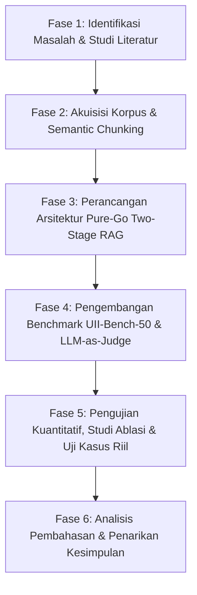

# BAB III
# METODOLOGI PENELITIAN DAN PERANCANGAN SISTEM

## 3.1 Alur Metodologi Penelitian

Penelitian ini dilaksanakan dengan mengikuti metodologi rekayasa perangkat lunak dan penelitian eksperimental terstruktur yang dirancang untuk menjamin validitas ilmiah serta keandalan sistem. Tahapan metodologi penelitian dipetakan ke dalam enam fase utama sebagaimana ditunjukkan pada Gambar 3.1:


*Gambar 3.1 Alur Tahapan Metodologi Penelitian AURA Core*

Secara terperinci, keenam fase tersebut mencakup:
1. **Fase 1: Identifikasi Masalah dan Studi Literatur**: Mengidentifikasi titik kritis kelemahan konsultasi akademik konvensional, risiko halusinasi RAG tahap tunggal, dan kelemahan runtime berbasis Python, serta menelaah teori terkait penelusuran vektor, reranking, dan evaluasi RAG Triad.
2. **Fase 2: Akuisisi Korpus dan *Semantic Chunking***: Mengumpulkan dokumen regulasi resmi FTI UII yang masih berlaku, melakukan kurasi teks, pembersihan data, serta segmentasi semantik berbasis bab, pasal, dan ayat.
3. **Fase 3: Perancangan dan Konstruksi Arsitektur Sistem**: Membangun modul *Pure-Go Native Orchestrator*, mengintegrasikan *Dense Vector Retrieval* (Pinecone), *Cross-Encoder Neural Reranking* (Cohere), *In-Memory Privacy Parser* untuk dokumen KHS/KRS, serta *Grounded Generation Engine* (DeepSeek).
4. **Fase 4: Perancangan Tolok Ukur Evaluasi (*UII-Bench-50*)**: Menyusun 50 skenario uji representatif dalam 5 klaster regulasi, serta membangun modul penguji otomatis *LLM-as-Judge* (`cmd/bench` dan `internal/benchmark`) berbasis pustaka standar Go.
5. **Fase 5: Eksekusi Eksperimen dan Pengujian Empiris**: Menjalankan evaluasi kuantitatif penuh terhadap 50 skenario uji, mengeksekusi studi ablasi komparatif (*Single-Stage vs Two-Stage*), mengukur profil latensi komputasi, serta menguji 15 studi kasus riil siklus hidup mahasiswa.
6. **Fase 6: Analisis Hasil dan Penarikan Kesimpulan**: Menganalisis metrik RAG Triad secara deskriptif dan statistik, mengkaji studi kasus batas (*adversarial edge cases*), serta merumuskan kesimpulan dan saran penelitian lanjutan.

---

## 3.2 Akuisisi dan Prapemrosesan Korpus Regulasi FTI UII

### 3.2.1 Sumber Korpus Otoritatif
Korpus pengetahuan institusional yang menjadi fondasi non-parametrik sistem AURA Core dikumpulkan secara resmi dari otoritas akademik Fakultas Teknologi Industri dan Universitas Islam Indonesia. Dokumen yang diakuisisi meliputi:
1. **Buku Pedoman Akademik Universitas Islam Indonesia (Edisi 2024)**: Terdiri dari 38 pasal yang mengatur hak/kewajiban mahasiswa, batas semester, penentuan beban SKS berbasis IPS, aturan cuti kuliah, hingga evaluasi batas masa studi semester 4 dan semester 8.
2. **Buku Pedoman Pelaksanaan Tugas Akhir dan Skripsi FTI UII (Edisi 2024)**: Terdiri dari 24 pasal yang mengatur prasyarat seminar proposal, syarat pembimbingan skripsi, masa berlaku SK pembimbing (1 semester dengan batas perpanjangan 1 semester), mekanisme seminar hasil, dan yudisium kelulusan.
3. **Pedoman Beasiswa DPK dan DPPAI UII**: Ketentuan bantuan dana kesejahteraan mahasiswa, verifikasi Surat Keterangan Tidak Mampu (SKTM), serta sertifikasi hafalan Al-Qur'an.
4. **Pedoman Integritas Akademik dan Pencegahan Plagiarisme FTI UII**: Aturan verifikasi orisinalitas naskah skripsi menggunakan *Turnitin* dengan batas kemiripan maksimal 20% (dengan opsi *exclude quotes* dan *exclude bibliography* aktif).

### 3.2.2 Strategi Segmentasi Dokumen (*Semantic Chunking*)
Pada dokumen hukum dan regulasi, strategi segmentasi teks berbasis panjang karakter acak (*fixed-character chunking*) sering kali memotong kalimat di tengah-tengah pasal, sehingga merusak konteks logis hukum. Oleh karena itu, penelitian ini menerapkan pendekatan *Hierarchical Semantic Chunking*:
- **Rentang Ukuran Chunk**: 500 hingga 800 token per segmen teks.
- **Overlap Jendela Teks**: 100 token antar-segmen yang berurutan guna menjaga kontinuitas semantik.
- **Preservasi Metadata Kontekstual**: Setiap potongan teks dilengkapi dengan injeksi metadata terstruktur pada tajuk segmen, yang memuat nama dokumen induk, nomor bab, judul bab, dan nomor pasal (misal: `[Dokumen: Pedoman Skripsi FTI 2024 | Bab II | Pasal 2: Prasyarat Seminar Proposal]`). Hal ini memastikan bahwa saat vektor teks diretrieve, model bahasa dapat mengetahui secara pasti nomor pasal rujukan.

Teks yang telah disegmentasi kemudian diproses menggunakan model Cohere `embed-multilingual-v3.0` untuk menghasilkan vektor 1024-dimensi dan disimpan ke dalam indeks Pinecone Serverless berorientasi ruang kemiripan *Cosine*.

---

## 3.3 Perancangan Arsitektur Sistem AURA Core (*Pure-Go Native*)

Arsitektur AURA Core dirancang sebagai sistem monolitik modular berkinerja tinggi (*high-performance modular monolith*) menggunakan bahasa Go tanpa menggunakan kerangka kerja pihak ketiga seperti Gin atau Echo. Diagram arsitektur alur data ditunjukkan pada Gambar 3.2:

```
[ Klien Mahasiswa / Web Browser ]
             │  (HTTPS / WSS Request: Teks Kueri + Unggahan KHS/KRS)
             ▼
┌─────────────────────────────────────────────────────────────────────────────┐
│                       AURA PURE-GO NATIVE GATEWAY                           │
│  - HTTP Router (net/http stdlib)      - Gorilla WebSocket Multiplexer       │
│  - Supabase Auth & RLS Session Guard  - Strict In-Memory Concurrency Pool   │
└─────────────────────────────────────┬───────────────────────────────────────┘
                                      │
        ┌─────────────────────────────┴─────────────────────────────┐
        ▼                                                           ▼
┌───────────────────────────────┐           ┌─────────────────────────────────┐
│     STAGE-1: DENSE ANN        │           │    ISOLASI PRIVASI MAHASISWA    │
│       VECTOR RETRIEVAL        │           │     (In-Memory RAM Parser)      │
│ - Embed query: 1024-dim       │           │ - Ekstraksi transkrip KHS/KRS   │
│ - Top-20 candidates search    │           │ - Parsing IPK, IPS, SKS, Nilai  │
│   pada Pinecone Serverless    │           │ - Data HANYA ada di RAM sesi    │
│ - Waktu eksekusi: ~300-350 ms │           │ - ZERO PERSISTENCE ke Vector DB │
└───────────────┬───────────────┘           └────────────────┬────────────────┘
                │ (20 Kandidat Pasal)                        │
                ▼                                            │
┌───────────────────────────────┐                            │
│     STAGE-2: CROSS-ENCODER    │                            │
│        NEURAL RERANKING       │                            │
│ - Model: Cohere Rerank v3.5   │                            │
│ - Full Cross-Attention query- │                            │
│   pasal interaksi silang      │                            │
│ - Filter & rank: Top-8 pasal  │                            │
│ - Waktu eksekusi: ~330 ms     │                            │
└───────────────┬───────────────┘                            │
                │ (8 Pasal Otoritatif Terpilih)              │
                └─────────────────────┬──────────────────────┘
                                      │ (Konteks Bersih: 8 Pasal + Profil KHS)
                                      ▼
┌─────────────────────────────────────────────────────────────────────────────┐
│                STAGE-3: CONSTRAINED GROUNDED GENERATION                     │
│  - Model: DeepSeek Engine (deepseek-chat)                                   │
│  - Parameter: Temperature tau = 0.2, Top-p = 0.95                           │
│  - Guardrails: Mandatory clause citation, Anti-hallucination verification   │
│  - Waktu eksekusi: ~3.2 - 3.8 detik                                         │
└─────────────────────────────────────┬───────────────────────────────────────┘
                                      │
                                      ▼
                 [ Streaming Respons Berisi Sitasi Resmi Pasal ]
```
*Gambar 3.2 Diagram Arsitektur Pipeline Pure-Go Native Two-Stage RAG AURA Core*

### 3.3.1 Tahap 1: *Dense Vector Retrieval* (Bi-Encoder ANN)
Pada tahap pertama, kueri pengguna $q$ dikonversi menjadi representasi vektor numerik berdimensi 1024 melalui model representasi semantik:

$$\mathbf{v}_q = f_{\text{embed}}(q) \in \mathbb{R}^{1024}$$

Vektor kueri $\mathbf{v}_q$ kemudian dikirimkan ke kluster indeks Pinecone Serverless $\mathcal{I}_{\text{reg}}$ untuk mengeksekusi pencarian *Approximate Nearest Neighbor* (ANN). Sistem mengidentifikasi himpunan 20 kandidat dokumen teratas $\mathcal{C}_{20}$ dengan menghitung nilai kemiripan kosinus:

$$\mathcal{C}_{20} = \operatorname{arg\,Top}_{p_i \in \mathcal{I}_{\text{reg}}}^{K=20} \left( \frac{\mathbf{v}_q \cdot \mathbf{v}_{p_i}}{\|\mathbf{v}_q\|_2 \|\mathbf{v}_{p_i}\|_2} \right)$$

Tujuan utama Tahap 1 adalah memaksimalkan perolehan (*recall*), memastikan bahwa semua potongan regulasi yang potensial terjaring ke dalam memori kerja sistem dengan latensi sekitar 300–350 milidetik.

### 3.3.2 Tahap 2: *Cross-Encoder Neural Reranking*
Karena pencarian vektor *bi-encoder* tidak mempertimbangkan interaksi mendalam antar-token, 20 kandidat dokumen $\mathcal{C}_{20} = \{p_1, p_2, \dots, p_{20}\}$ kerap kali mengandung dokumen pengganggu (*noise*) yang sekadar mirip secara kata kunci namun salah secara substansi hukum.

Pada Tahap 2, setiap pasangan kueri dan kandidat pasal $(q, p_i)$ disuapkan ke dalam model *Cross-Encoder Neural Reranker* (Cohere Rerank v3.5). Model melakukan komputasi *full cross-attention* di seluruh lapisan transformer guna menghasilkan skor relevansi diskret $s_i$:

$$s_i = g_{\text{rerank}}(q, p_i) \in [0.0, 1.0], \quad \forall p_i \in \mathcal{C}_{20}$$

Kandidat diurutkan secara menurun (*descending*) berdasarkan nilai $s_i$, dan sistem hanya mengambil $N = 8$ pasal teratas:

$$\mathcal{P}_8 = \operatorname{arg\,Top}_{p_i \in \mathcal{C}_{20}}^{N=8} (s_i)$$

Tahap ini mengeliminasi 12 dokumen subordinat yang kurang relevan, menyusutkan panjang konteks masukan secara drastis, serta memitigasi risiko *Lost in the Middle* dengan latensi tambahan hanya sekitar 330 milidetik.

### 3.3.3 Mekanisme Privasi Mahasiswa (*In-Memory Privacy Parser*)
Salah satu kebaruan arsitektural AURA Core adalah perlindungan data pribadi mahasiswa yang dijamin secara deterministik pada tingkat arsitektur perangkat lunak:
1. Ketika mahasiswa mengunggah dokumen KHS atau KRS dalam bentuk PDF atau tabel digital, berkas tersebut diterima oleh modul *streaming buffer* Go (`io.Reader`).
2. Teks transkrip diekstraksi secara *strictly in-memory* (hanya berada di RAM selama siklus eksekusi goroutine aktif). Fitur akademik penting (total SKS lulus, IPK kumulatif, IPS semester terakhir, dan daftar nilai berpredikat D atau E) dirangkum ke dalam struktur data sesi:
   $$\mathcal{T}_{\text{student}} = \{\text{SKS}_{\text{lulus}}, \text{IPK}, \text{IPS}_{\text{lalu}}, \text{DaftarNilai}_{\text{kritis}}\}$$
3. Struktur $\mathcal{T}_{\text{student}}$ ini digabungkan secara langsung ke dalam konteks perintah sesaat (*ephemeral prompt context*) bersama 8 pasal resmi $\mathcal{P}_8$.
4. **Jaminan Nir-Persistensi**: Data akademik mahasiswa **TIDAK PERNAH dikirimkan ke model embedding, tidak pernah diindeks, dan tidak pernah disimpan ke dalam basis data vektor Pinecone publik**. Setelah respons streaming selesai dikirimkan ke pengguna, buffer memori langsung dibebaskan oleh *Garbage Collector* Go.

### 3.3.4 Tahap 3: *Constrained Grounded Reasoning & Citation Enforcement*
Konteks gabungan $\mathcal{X} = \{\mathcal{P}_8, \mathcal{T}_{\text{student}}\}$ diteruskan ke mesin inferensi DeepSeek (`deepseek-chat`) dengan parameter suhu $\tau = 0.2$. Nilai $\tau = 0.2$ dipilih untuk membatasi variasi acak pembangkitan token tanpa menghilangkan keluwesan artikulasi bahasa alami.

Sistem menerapkan instruksi sistem (*system prompt*) berbasis tiga batas perlindungan (*guardrails*):
1. **Aturan Sitasi Pasal Eksplisit (*Mandatory Citation Rule*)**: Setiap pernyataan normatif (misalnya pemberian izin, penolakan, batas SKS, atau masa berlaku) wajib menyertakan dokumen rujukan dan nomor pasal yang valid (contoh: `[Buku Pedoman Akademik UII, Pasal 10]` atau `[Buku Pedoman Skripsi FTI UII, Pasal 2 Ayat 1]`).
2. **Penolakan Prosedur Fiktif (*Adversarial Rejection*)**: Jika mahasiswa menanyakan prosedur dispensasi fiktif (seperti surat keterangan RT/RW untuk dispensasi sempro), sistem diinstruksikan untuk secara tegas menolak eksistensi aturan tersebut dan membacakan syarat kumulatif yang sah.
3. **Kejujuran Epistemik (*Epistemic Humility*) dan Penanganan Luar Domain (*Out-of-Domain / OOD*)**: Jika pertanyaan menyangkut regulasi fakultas lain di luar FTI (misalnya Fakultas Kedokteran) atau aturan yang tidak tercakup dalam basis data, sistem dilarang berspekulasi dan wajib mengarahkan mahasiswa ke Divisi Administrasi Akademik (DAA) universitas.

---

## 3.4 Desain Pengujian dan Metrik Evaluasi

### 3.4.1 Dataset Tolok Ukur *UII-Bench-50*
Untuk mengevaluasi performa sistem secara kuantitatif dan dapat direproduksi (*reproducible*), disusunlah dataset *UII-Bench-50* yang memetakan 50 skenario kasus regulasi akademik riil di lingkungan FTI UII. Dataset ini dibagi rata ke dalam lima klaster regulasi sebagaimana dipaparkan pada Tabel 3.1.

**Tabel 3.1** Distribusi Skenario Pengujian pada Dataset UII-Bench-50
| Klaster | Nama Klaster Regulasi | Jumlah Skenario ($N$) | Cakupan Masalah dan Batasan Hukum yang Diuji |
|:---:|---|:---:|---|
| **Klaster 1** | Prasyarat Seminar Proposal Skripsi | 10 (S01–S10) | Batas minimal 110 SKS lulus, ambang batas IPK $\ge 2.00$, larangan keberadaan nilai E, kelulusan mata kuliah Metodologi Penelitian minimal nilai C, dan persetujuan draf oleh dosen pembimbing. |
| **Klaster 2** | Beban SKS Semester & Nilai IPS | 10 (S11–S20) | Konversi jatah SKS berdasarkan IPS semester lalu (IPS $\ge 3.00 \to 24$ SKS; $2.50 \le \text{IPS} < 3.00 \to 21$ SKS; dsb.), batas SKS semester pendek (maksimal 9 SKS), dan penolakan jatah SKS melebihi batas legal 24 SKS. |
| **Klaster 3** | Masa Berlaku SK & Pembimbingan | 10 (S21–S30) | Durasi aktif SK pembimbing tugas akhir (1 semester), batas maksimal perpanjangan (1 kali perpanjangan / 1 semester tambahan), syarat logbook bimbingan minimal 8 kali, dan pergantian pembimbing. |
| **Klaster 4** | Batas Toleransi Turnitin & Plagiarisme | 10 (S31–S40) | Ambang batas maksimal *similarity index* 20%, verifikasi konfigurasi *exclude quotes* dan *exclude bibliography*, prosedur cek ulang jika melebihi batas, dan sanksi pelanggaran etika akademik. |
| **Klaster 5** | Evaluasi Studi & Yudisium Kelulusan | 10 (S41–S50) | Total penyelesaian minimal 144 SKS, batas maksimal persentase nilai D ($\le 10\%$ atau 14 SKS), skor minimal CEPT CILACS (450 untuk S1 Reguler), evaluasi DO semester 4 (minimal 35 SKS) dan semester 8 (minimal 70 SKS). |

### 3.4.2 Implementasi *Automated LLM-as-Judge Runner*
Evaluasi terhadap 50 skenario dieksekusi secara otomatis melalui runner berbasis Go yang dibangun di dalam repositori (`cmd/bench/main.go` dan `internal/benchmark`). Penguji otomatis ini bekerja dengan alur:
1. Memuat seluruh berkas skenario dari `testdata/uii_bench_50.json`.
2. Menyuapkan setiap kueri $q$ ke dalam pipeline AURA Core untuk memperoleh konteks terpilih $\mathcal{P}$ dan jawaban sistem $a$.
3. Mengirimkan triplet $(q, \mathcal{P}, a)$ ke model penilai (*Judge LLM*) dengan suhu $\tau = 0.0$ untuk menghasilkan skor deterministik pada rentang $[0.0, 1.0]$ untuk ketiga metrik RAG Triad:
   - **Context Relevance (CR)**: Penilai memeriksa rasio keterpautan konteks pasal yang diretrieve terhadap kueri mahasiswa.
   - **Groundedness (G)**: Penilai memecah jawaban sistem menjadi proposisi klaim independen dan memverifikasi apakah klaim tersebut memiliki rujukan faktual pada teks pasal.
   - **Answer Relevance (AR)**: Penilai mengukur kelengkapan dan ketajaman jawaban sistem dalam menyelesaikan inti masalah kueri.
4. Menghitung rata-rata harmonik *RAG Triad Score* (RTS) untuk setiap skenario serta mengekspor seluruh rekapitulasi data ke dalam format CSV dan Markdown di direktori `benchmark_results/`.

### 3.4.3 Desain Eksperimen Studi Ablasi (*Ablation Study*)
Untuk membuktikan secara ilmiah keunggulan arsitektur *Two-Stage RAG* dibandingkan arsitektur konvensional, dilakukan pengujian ablasi terkontrol:
- **Baseline (Single-Stage RAG)**: Tahap *Cross-Encoder Neural Reranking* dimatikan secara terprogram (`disableRerank = true`). Kandidat Top-8 dari hasil penelusuran vektor *dense ANN* Pinecone langsung disuapkan ke LLM generator.
- **Proposed Architecture (Two-Stage RAG)**: Pipeline lengkap AURA Core dijalankan, di mana Top-20 kandidat ANN disaring kembali oleh *Cross-Encoder* Cohere Rerank v3.5 menjadi Top-8 sebelum disuapkan ke LLM generator.
- Pengujian dijalankan pada dataset *UII-Bench-50* yang identik, dan hasil komparasi metrik $CR$, $G$, $AR$, $RTS$, serta delta waktu komputasi dianalisis.

### 3.4.4 Desain 15 Studi Kasus Siklus Hidup Mahasiswa (*CS01–CS15*)
Di samping pengujian kuantitatif agregat, dirancang 15 studi kasus kualitatif yang merepresentasikan seluruh rentang siklus studi sarjana (mulai dari semester awal, masa penentuan beban SKS, fase tugas akhir, hingga yudisium dan evaluasi putus studi). Pengujian ini bertujuan untuk membuktikan keandalan sistem dalam memverifikasi profil mahasiswa secara *case-by-case* dengan hasil keputusan (*verdict*) yang deterministik dan adil sesuai regulasi yang berlaku.
