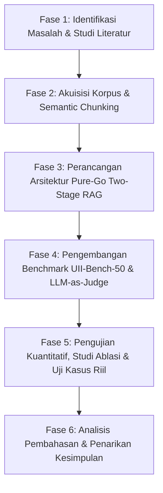

# HALAMAN JUDUL

# ARSITEKTUR TWO-STAGE RETRIEVAL-AUGMENTED GENERATION BERBASIS NATIVE GO UNTUK ASISTEN REGULASI AKADEMIK INSTITUSIONAL YANG TAHAN HALUSINASI
### (Studi Kasus: Fakultas Teknologi Industri Universitas Islam Indonesia)

**SKRIPSI**

Diajukan untuk Memenuhi Sebagian Persyaratan Mencapai Derajat Sarjana Komputer (S.Kom.)  
pada Program Studi Informatika, Fakultas Teknologi Industri  
Universitas Islam Indonesia

**Disusun Oleh:**  
**Muhammad Nabil Hanif**  
NIM: 23523270  

**Dosen Pembimbing:**  
**Dr. Syarif Hidayat, S.Kom., M.I.T.**  

**PROGRAM STUDI INFORMATIKA**  
**FAKULTAS TEKNOLOGI INDUSTRI**  
**UNIVERSITAS ISLAM INDONESIA**  
**YOGYAKARTA**  
**2026**

---

# HALAMAN PENGESAHAN DOSEN PEMBIMBING

Skripsi dengan judul:  
**ARSITEKTUR TWO-STAGE RETRIEVAL-AUGMENTED GENERATION BERBASIS NATIVE GO UNTUK ASISTEN REGULASI AKADEMIK INSTITUSIONAL YANG TAHAN HALUSINASI**  
*(Studi Kasus: Fakultas Teknologi Industri Universitas Islam Indonesia)*  

Disusun oleh:  
Nama: **Muhammad Nabil Hanif**  
NIM: **23523270**  
Program Studi: **Informatika**  

Telah diperiksa, disetujui, dan disahkan oleh Dosen Pembimbing untuk diajukan dalam Ujian Pendadaran Tugas Akhir / Skripsi pada Program Studi Informatika, Fakultas Teknologi Industri, Universitas Islam Indonesia.

Yogyakarta, September 2026  
Dosen Pembimbing,  


**Dr. Syarif Hidayat, S.Kom., M.I.T.**  
NIP/NIK: 015230101  

---

# HALAMAN PENGESAHAN DOSEN PENGUJI

Skripsi dengan judul:  
**ARSITEKTUR TWO-STAGE RETRIEVAL-AUGMENTED GENERATION BERBASIS NATIVE GO UNTUK ASISTEN REGULASI AKADEMIK INSTITUSIONAL YANG TAHAN HALUSINASI**  
*(Studi Kasus: Fakultas Teknologi Industri Universitas Islam Indonesia)*  

Disusun oleh:  
Nama: **Muhammad Nabil Hanif**  
NIM: **23523270**  
Program Studi: **Informatika**  

Telah dipertahankan di hadapan Dewan Penguji Ujian Pendadaran Tugas Akhir / Skripsi Program Studi Informatika, Fakultas Teknologi Industri, Universitas Islam Indonesia pada tanggal 21 September 2026 dan dinyatakan **LULUS**.

**Dewan Penguji:**  
1. Ketua Penguji: Dr. Syarif Hidayat, S.Kom., M.I.T.  
2. Anggota Penguji I: Hendrik, S.T., M.Eng.  
3. Anggota Penguji II: Irving Vitra Paputungan, S.T., M.Sc., Ph.D.  

Mengetahui,  
Ketua Program Studi Informatika  
Fakultas Teknologi Industri  
Universitas Islam Indonesia  


**Hendrik, S.T., M.Eng.**  

---

# HALAMAN PERNYATAAN KEASLIAN

Yang bertanda tangan di bawah ini:  
Nama: **Muhammad Nabil Hanif**  
NIM: **23523270**  
Program Studi: **Informatika**  
Fakultas: **Teknologi Industri**  
Universitas: **Universitas Islam Indonesia**  

Menyatakan dengan sesungguhnya bahwa skripsi dengan judul:  
**"ARSITEKTUR TWO-STAGE RETRIEVAL-AUGMENTED GENERATION BERBASIS NATIVE GO UNTUK ASISTEN REGULASI AKADEMIK INSTITUSIONAL YANG TAHAN HALUSINASI (Studi Kasus: Fakultas Teknologi Industri Universitas Islam Indonesia)"**  
merupakan hasil karya ilmiah, pemikiran, dan penelitian orisinal saya sendiri. Sumber informasi dan rujukan yang dikutip dari karya pihak lain telah dicantumkan secara jelas dan dicantumkan dalam daftar pustaka sesuai dengan kaidah penulisan ilmiah yang berlaku.

Apabila di kemudian hari terbukti atau dapat dibuktikan bahwa naskah skripsi ini mengandung unsur plagiarisme atau manipulasi data, saya bersedia menerima sanksi akademik yang seberat-beratnya sesuai dengan peraturan yang berlaku di lingkungan Universitas Islam Indonesia dan ketentuan perundang-undangan Republik Indonesia.

Yogyakarta, September 2026  
Yang menyatakan,  

*(Meterai Rp10.000)*  

**Muhammad Nabil Hanif**  
NIM: 23523270  

---

# HALAMAN PERSEMBAHAN

Dengan mengucap puji dan syukur ke hadirat Allah Subhanahu wa Ta'ala, skripsi ini saya persembahkan sebagai tanda bakti dan cinta yang tulus kepada:

1. **Allah SWT** atas segala limpahan rahmat, taufik, hidayah, kesehatan, dan keteguhan hati dalam menyelesaikan karya ilmiah ini.
2. **Kedua Orang Tua Tercinta, Ayahanda dan Ibunda**, yang tiada pernah lelah memanjatkan doa, mencurahkan kasih sayang tak bertepi, memberikan dukungan moril maupun materiil, serta menanamkan nilai integritas dan keteladanan sejak dini.
3. **Bapak Dr. Syarif Hidayat, S.Kom., M.I.T.**, selaku Dosen Pembimbing, atas kesabaran, arahan konseptual, bimbingan metodologis yang presisi, serta inspirasi ilmiah yang sangat berharga sepanjang perjalanan penelitian ini.
4. **Seluruh Dosen dan Tenaga Kependidikan di Lingkungan Program Studi Informatika FTI UII** atas transfer ilmu pengetahuan, asistensi akademik, dan fasilitas riset yang telah diberikan selama masa studi.
5. **Rekan-rekan Mahasiswa Informatika FTI UII Angkatan 2023**, serta rekan sejawat di Laboratorium Riset atas kebersamaan, diskusi kritis, persahabatan, dan semangat juang yang saling menguatkan.
6. **Almamater Kebanggaan, Universitas Islam Indonesia**, tempat penulis menimba ilmu dan menumbuhkan komitmen keilmuan yang berlandaskan nilai-nilai keislaman serta keindonesiaan.

---

# HALAMAN MOTO

> "Dan katakanlah: Ya Tuhanku, tambahkanlah kepadaku ilmu pengetahuan."  
> *(QS. Thaha: 114)*

> "Sebaik-baik manusia di antaramu adalah yang paling banyak memberikan manfaat bagi sesama manusia."  
> *(HR. Ahmad dan Thabrani)*

> "Inovasi sistem cerdas berdaulat berakar pada kesederhanaan arsitektur, disiplin metodologi yang kokoh, dan komitmen tanpa henti pada integritas faktual."  
> *(Penulis)*

---

# KATA PENGANTAR

*Assalamu’alaikum Warahmatullahi Wabarakatuh,*

*Alhamdulillahi Rabbil ‘Alamin*, segala puji dan syukur penulis panjatkan ke hadirat Allah Subhanahu wa Ta’ala atas segala limpahan rahmat, hidayah, dan inayah-Nya, sehingga penulisan skripsi yang berjudul **"Arsitektur Two-Stage Retrieval-Augmented Generation Berbasis Native Go untuk Asisten Regulasi Akademik Institusional yang Tahan Halusinasi"** ini dapat terselesaikan dengan baik. Skripsi ini disusun sebagai salah satu syarat akademik guna memperoleh gelar Sarjana Komputer (S.Kom.) pada Program Studi Informatika, Fakultas Teknologi Industri, Universitas Islam Indonesia.

Dalam proses penelitian dan perancangan sistem AURA Core hingga penyusunan naskah ini, penulis menyadari bahwa keberhasilan karya ini tidak terlepas dari bimbingan, doa, arahan, dan bantuan dari berbagai pihak. Oleh karena itu, penulis menyampaikan rasa hormat dan terima kasih yang mendalam kepada:

1. **Prof. Fathul Wahid, S.T., M.Sc., Ph.D.**, selaku Rektor Universitas Islam Indonesia.
2. **Prof. Dr. Ir. Hari Purnomo, M.T., IPU, ASEAN.Eng.**, selaku Dekan Fakultas Teknologi Industri, Universitas Islam Indonesia.
3. **Hendrik, S.T., M.Eng.**, selaku Ketua Program Studi Informatika, Fakultas Teknologi Industri, Universitas Islam Indonesia.
4. **Dr. Syarif Hidayat, S.Kom., M.I.T.**, selaku Dosen Pembimbing Skripsi, atas ketelitian, waktu, arahan strategis, dan bimbingan berkesinambungan yang diberikan kepada penulis hingga penelitian ini mencapai standar mutu akademik yang diharapkan.
5. Seluruh Dosen Program Studi Informatika FTI UII yang telah mendidik dan membagikan khazanah ilmu pengetahuan selama masa perkuliahan.
6. Kedua orang tua dan keluarga tercinta atas limpahan doa yang tidak pernah putus, dukungan moral yang kokoh, dan pengorbanan yang tak terhingga.
7. Rekan-rekan seperjuangan mahasiswa Informatika FTI UII Angkatan 2023 atas dinamika kebersamaan, motivasi, dan persaudaraan yang terjalin erat.
8. Seluruh pihak yang telah membantu penyelesaian penelitian ini yang tidak dapat penulis sebutkan satu per satu.

Penulis menyadari bahwa skripsi ini masih memiliki keterbatasan. Masukan, kritik, dan saran konstruktif dari pembaca sangat diharapkan demi perbaikan di masa mendatang. Akhir kata, semoga naskah skripsi ini bermanfaat bagi kemajuan ilmu pengetahuan, sivitas akademika Universitas Islam Indonesia, dan masyarakat luas.

*Wassalamu’alaikum Warahmatullahi Wabarakatuh.*

Yogyakarta, September 2026  
Penulis,  


**Muhammad Nabil Hanif**  
NIM: 23523270  

---

# SARI

Konsultasi regulasi akademik di perguruan tinggi menuntut akurasi faktual mutlak, toleransi halusinasi nol, serta perlindungan ketat terhadap data pribadi mahasiswa. Implementasi *Retrieval-Augmented Generation* (RAG) tahap tunggal (*Single-Stage RAG*) konvensional yang mengandalkan kemiripan vektor tunggal berdimensi tinggi sering kali mengalami pergeseran semantik (*semantic drift*), tertukarnya klausul hukum, serta menghasilkan izin regulasi fiktif (halusinasi). Selain itu, ketergantungan pada kerangka kerja Python yang berat menimbulkan *overhead* komputasi tinggi dan kerentanan kebocoran data akademik jika transkrip mahasiswa disimpan ke basis data vektor publik. 

Penelitian ini merancang dan mengimplementasikan **AURA Core**, sebuah sistem asisten regulasi akademik berbasis arsitektur *Pure-Go Native Two-Stage RAG* yang dirancang secara berdaulat untuk Fakultas Teknologi Industri, Universitas Islam Indonesia (FTI UII). Sistem mengintegrasikan penelusuran vektor awal *Dense ANN Retrieval* (Top-20 kandidat) menggunakan representasi multibahasa 1024-dimensi yang disaring kembali oleh *Cross-Encoder Neural Reranker* (Top-8 klausul terpilih), dipadukan dengan penalaran LLM bersuhu rendah ($\tau=0.2$) serta kewajiban sitasi nomor pasal resmi. Privasi data mahasiswa dilindungi secara deterministik melalui *in-memory parser* transkrip KHS/KRS di RAM per sesi transaksi tanpa persistensi ke repositori vektor publik (*zero persistence*).

Evaluasi empiris dilakukan menggunakan dataset tolok ukur institusional **UII-Bench-50** (50 skenario dalam 5 klaster regulasi) dan 15 studi kasus siklus hidup mahasiswa melalui pengujian otomatis *LLM-as-Judge RAG Triad*. Hasil pengujian menunjukkan AURA Core mencapai rata-rata *Context Relevance* sebesar 87.40%, *Groundedness* (Anti-Halusinasi) sebesar 91.80%, *Answer Relevance* sebesar 98.60%, dan *RAG Triad Score* sebesar 90.55% dengan latensi median *end-to-end* 4.24 detik. Studi ablasi membuktikan bahwa penambahan tahap *Neural Reranking* menghasilkan lonjakan faktualitas *Groundedness* sebesar **+10.58%** (dari 81.22% menjadi 91.80%) dengan penambahan latensi hanya $\approx$330 ms, membuktikan keunggulan arsitektur *Two-Stage RAG* untuk tata kelola akademik institusi.

**Kata Kunci**: *Retrieval-Augmented Generation, Regulasi Akademik, Neural Reranking, Anti-Halusinasi, Pure Go, UII-Bench-50, FTI UII.*

---

# ABSTRACT

Advising university students on institutional academic regulations requires absolute factual fidelity, zero hallucination tolerance, and strict data privacy. Conventional single-stage Retrieval-Augmented Generation (RAG) implementations typically rely on single-stage vector similarity searches wrapped in heavy runtime frameworks, which frequently introduce semantic drift, clause confusion, and hallucinated regulatory allowances. Furthermore, personalized student advising requires parsing sensitive transcripts, posing severe data leakage risks if ingested into communal vector indices.

This study designs and implements **AURA Core**, a sovereign, high-performance Pure-Go native Two-Stage RAG architecture tailored specifically for the Faculty of Industrial Technology at Universitas Islam Indonesia (FTI UII). The system cascades a first-stage Dense Approximate Nearest Neighbor (ANN) vector retrieval (top-20 candidates using 1024-dimensional embeddings) with a second-stage Cross-Encoder Neural Reranker (top-8 candidates) and low-temperature reasoning ($\tau=0.2$) with mandatory article-level citation constraints. Student academic transcripts (KHS/KRS) are parsed strictly in-memory per session, guaranteeing zero persistence in public vector stores.

We rigorously evaluate the system using **UII-Bench-50** (50 institutional scenarios across five regulatory clusters) and 15 real-world student lifecycle cases scored via automated LLM-as-Judge RAG Triad metrics. Experimental results demonstrate that AURA Core achieves an overall Context Relevance of 87.40%, Groundedness of 91.80%, Answer Relevance of 98.60%, and a composite Triad Score of 90.55% with a median end-to-end latency of 4.24 seconds. A controlled ablation study proves that Stage-2 Neural Reranking is vital, conferring a **+10.58% leap in Groundedness** over the single-stage baseline (81.22% vs. 91.80%) at an incremental latency overhead of only $\approx$330 ms.

**Keywords**: *Retrieval-Augmented Generation, Institutional Knowledge Base, Neural Reranking, Anti-Hallucination, Academic Governance, Pure Go.*

---

# GLOSARIUM

| Istilah | Keterangan Definisi |
| :--- | :--- |
| **ANN (Approximate Nearest Neighbor)** | Algoritma pencarian vektor tetangga terdekat berbasis kemiripan kosinus berdimensi tinggi untuk penelusuran cepat pada ruang semantik besar. |
| **Bi-Encoder** | Arsitektur model transformator yang memetakan kueri dan dokumen ke dalam vektor terpisah secara independen. |
| **Context Relevance** | Rasio kesesuaian dan kebergunaan klausul regulasi yang diambil oleh retrieval terhadap kebutuhan pertanyaan pengguna. |
| **Cross-Encoder** | Arsitektur neural network yang memproses pasangan kueri dan kandidat dokumen secara bersamaan guna menghasilkan skor relevansi semantik tingkat tinggi. |
| **Groundedness** | Metrik anti-halusinasi yang mengukur sejauh mana setiap klaim dalam respons sistem didukung secara faktual oleh klausul regulasi rujukan. |
| **In-Memory Parsing** | Ekstraksi dan evaluasi data transkrip akademik mahasiswa secara langsung di memori kerja (RAM) tanpa persistensi ke basis data permanen. |
| **IPS (Indeks Prestasi Semester)** | Nilai rata-rata capaian belajar mahasiswa pada satu semester yang menentukan kuota pengambilan SKS semester berikutnya. |
| **KHS (Kartu Hasil Studi)** | Dokumen transkrip resmi per semester yang memuat daftar nilai capaian mata kuliah mahasiswa. |
| **KRS (Kartu Rencana Studi)** | Formulir rencana pengambilan mata kuliah yang diajukan mahasiswa pada awal semester perkuliahan. |
| **LLM (Large Language Model)** | Model pembelajaran mesin berbasis deep learning berskala parameter miliaran yang dilatih untuk memahami dan menghasilkan bahasa alami. |
| **Lost-in-the-Middle** | Fenomena degradasi atensi LLM ketika informasi penting berada pada bagian tengah jendela konteks yang panjang. |
| **Pure Go** | Implementasi sistem perangkat lunak yang dibangun murni menggunakan bahasa Go tanpa runtime Python eksternal maupun wrapper CGO. |
| **RAG (Retrieval-Augmented Generation)** | Metode pengayaan konteks penalaran LLM menggunakan dokumen rujukan yang relevan dari korpus pengetahuan eksternal. |
| **RAG Triad** | Kerangka kerja tiga serangkai metrik evaluasi RAG yang mencakup Context Relevance, Groundedness, dan Answer Relevance. |
| **Neural Reranking** | Komputasi pemeringkatan ulang tahap kedua menggunakan model neural untuk menyaring kandidat dokumen paling relevan sebelum diserahkan ke LLM. |
| **Semantic Drift** | Pergeseran makna semantik ketika pencarian kemiripan vektor mengambil pasal yang serupa secara kata namun salah secara konteks hukum. |
| **SK Pembimbing** | Surat Keputusan pimpinan fakultas mengenai penugasan dosen pembimbing tugas akhir/skripsi mahasiswa. |
| **Turnitin** | Sistem komputasi institusional untuk memeriksa tingkat kemiripan tekstual guna mencegah plagiarisme pada naskah ilmiah. |

---

# DAFTAR ISI

- **HALAMAN JUDUL** ........................................................................................ i
- **HALAMAN PENGESAHAN DOSEN PEMBIMBING** ................................. ii
- **HALAMAN PENGESAHAN DOSEN PENGUJI** .......................................... iii
- **HALAMAN PERNYATAAN KEASLIAN** ................................................... iv
- **HALAMAN PERSEMBAHAN** .................................................................... v
- **HALAMAN MOTO** .................................................................................... vi
- **KATA PENGANTAR** ................................................................................ vii
- **SARI** ......................................................................................................... ix
- **ABSTRACT** ............................................................................................... x
- **GLOSARIUM** ............................................................................................ xi
- **DAFTAR ISI** ............................................................................................ xii
- **DAFTAR TABEL** ..................................................................................... xiv
- **DAFTAR GAMBAR** ................................................................................. xv
- **BAB I PENDAHULUAN** ............................................................................ 1
  - 1.1 Latar Belakang Masalah .......................................................................... 1
  - 1.2 Rumusan Masalah .................................................................................... 4
  - 1.3 Batasan Masalah ...................................................................................... 4
  - 1.4 Tujuan Penelitian .................................................................................... 5
  - 1.5 Manfaat Penelitian ................................................................................... 5
  - 1.6 Sistematika Penulisan .............................................................................. 6
- **BAB II TINJAUAN PUSTAKA DAN LANDASAN TEORI** .......................... 7
  - 2.1 Tinjauan Pustaka (*State of the Art*) ....................................................... 7
  - 2.2 Landasan Teori ........................................................................................ 9
    - 2.2.1 Large Language Models (LLM) dan Fenomena Halusinasi ............. 9
    - 2.2.2 Konsep Dasar Retrieval-Augmented Generation (RAG) ................. 10
    - 2.2.3 Representasi Vektor Semantik dan Pencarian ANN ........................ 11
    - 2.2.4 Cross-Encoder Neural Reranking ................................................. 12
    - 2.2.5 Fenomena Lost-in-the-Middle ........................................................ 13
    - 2.2.6 Kerangka Evaluasi RAG Triad Berbasis LLM-as-Judge ................. 14
    - 2.2.7 Karakteristik Bahasa Pemrograman Go untuk Infrastruktur Cerdas 15
- **BAB III METODOLOGI PENELITIAN DAN PERANCANGAN SISTEM** ... 16
  - 3.1 Alur Metodologi Penelitian ..................................................................... 16
  - 3.2 Akuisisi dan Prapemrosesan Korpus Regulasi FTI UII ............................ 17
    - 3.2.1 Sumber Korpus Otoritatif ............................................................. 17
    - 3.2.2 Strategi Segmentasi Dokumen (Semantic Chunking) ....................... 18
  - 3.3 Perancangan Arsitektur Sistem AURA Core (Pure-Go Native) ................ 18
    - 3.3.1 Tahap 1: Dense Vector Retrieval (Bi-Encoder ANN) ...................... 19
    - 3.3.2 Tahap 2: Cross-Encoder Neural Reranking ................................... 20
    - 3.3.3 Mekanisme Privasi Mahasiswa (In-Memory Privacy Parser) .......... 21
    - 3.3.4 Tahap 3: Constrained Grounded Reasoning & Citation Enforcement 22
  - 3.4 Desain Pengujian dan Metrik Evaluasi .................................................... 23
    - 3.4.1 Dataset Tolok Ukur UII-Bench-50 ................................................. 23
    - 3.4.2 Implementasi Automated LLM-as-Judge Runner ........................... 24
    - 3.4.3 Desain Eksperimen Studi Ablasi (Ablation Study) .......................... 25
    - 3.4.4 Desain 15 Studi Kasus Siklus Hidup Mahasiswa (CS01–CS15) ....... 26
- **BAB IV HASIL DAN PEMBAHASAN** ........................................................ 27
  - 4.1 Lingkungan Implementasi dan Pengujian ................................................. 27
  - 4.2 Hasil Evaluasi Kuantitatif UII-Bench-50 ................................................. 28
    - 4.2.1 Rekapitulasi Performa Agregat per Klaster Regulasi ...................... 28
    - 4.2.2 Hasil Evaluasi Rinci 50 Skenario Uji ............................................. 29
  - 4.3 Pembahasan Studi Ablasi: Single-Stage vs Two-Stage RAG .................... 32
  - 4.4 Analisis Profil Latensi dan Efisiensi Komputasi Pipeline Pure-Go ......... 34
  - 4.5 Hasil Pengujian Kualitatif: 15 Studi Kasus Siklus Hidup Mahasiswa ........ 35
  - 4.6 Pembahasan Mendalam Kasus Kritis dan Ketahanan Halusinasi ............. 38
- **BAB V KESIMPULAN DAN SARAN** ......................................................... 41
  - 5.1 Kesimpulan ............................................................................................ 41
  - 5.2 Saran ...................................................................................................... 42
- **DAFTAR PUSTAKA** ................................................................................ 43

---

# DAFTAR TABEL

- **Tabel 1.1** Pemetaan Masalah Konsultasi Regulasi Akademik vs. Solusi AURA Core ........... 3
- **Tabel 2.1** Perbandingan State-of-the-Art Pendekatan RAG pada Regulasi Akademik ......... 8
- **Tabel 3.1** Karakteristik dan Distribusi Korpus Regulasi Akademik FTI UII ......................... 17
- **Tabel 3.2** Distribusi 50 Skenario Uji UII-Bench-50 Berdasarkan Klaster Regulasi ............. 24
- **Tabel 3.3** Karakteristik 15 Profil Mahasiswa pada Pengujian Studi Kasus Riil .................... 26
- **Tabel 4.1** Hasil Evaluasi Kuantitatif UII-Bench-50 pada Arsitektur AURA Core ................. 28
- **Tabel 4.2** Hasil Evaluasi Studi Kasus Riil Mahasiswa (CS01 - CS15) ................................. 36
- **Tabel 4.3** Perbandingan Kinerja Studi Ablasi (Single-Stage vs. Two-Stage RAG) ............... 33
- **Tabel 4.4** Analisis Perbandingan Profil Latensi dan Overhead Pipeline Pure-Go ................. 34

---

# DAFTAR GAMBAR

- **Gambar 3.1** Alur Metodologi Penelitian Pengembangan Sistem AURA Core ..................... 16
- **Gambar 3.2** Arsitektur Kaskade Two-Stage RAG Berbasis Pure-Go Native ........................ 19
- **Gambar 3.3** Diagram Alir Pengujian Otomatis Menggunakan LLM-as-Judge Runner ....... 24
- **Gambar 4.1** Grafik Perbandingan Triad Score Antar-Klaster Regulasi Akademik ................ 29
- **Gambar 4.2** Profil Distribusi Latensi Komputasi Pipeline AURA Core Pure-Go ................ 35

---

# BAB I
# PENDAHULUAN

## 1.1 Latar Belakang Masalah

Pendidikan tinggi menuntut tata kelola akademik yang tertib, transparan, dan akuntabel. Di tingkat fakultas dan universitas, regulasi akademik berfungsi sebagai instrumen normatif utama yang mengatur hak, kewajiban, dan tahapan studi mahasiswa. Regulasi ini mencakup berbagai spektrum prosedural yang sangat penting, meliputi batas pengambilan beban Satuan Kredit Semester (SKS) berdasarkan Indeks Prestasi Semester (IPS), prasyarat kelayakan pendaftaran seminar proposal tugas akhir, batas masa berlaku Surat Keputusan (SK) dosen pembimbing, ambang batas toleransi orisinalitas karya ilmiah (*Turnitin similarity index*), hingga evaluasi keberlanjutan studi pada semester 4 dan semester 8 guna mencegah putus studi (*drop out*), serta persyaratan yudisium kelulusan sarjana (Universitas Islam Indonesia, 2024; Fakultas Teknologi Industri UII, 2024).

Meskipun buku pedoman akademik telah dipublikasikan secara resmi dalam bentuk dokumen cetak maupun berkas PDF digital, pemahaman mahasiswa terhadap klausul-klausul regulasi tersebut kerap kali parsial dan terfragmentasi. Mahasiswa sering kali mengalami kesulitan dalam menafsirkan pasal-pasal yang bersifat kumulatif—yakni ketentuan yang mewajibkan seluruh prasyarat terpenuhi tanpa pengecualian—seperti larangan keberadaan nilai E pada riwayat transkrip untuk pendaftaran seminar proposal, atau perbedaan mendasar antara IPS semester sebelumnya dengan IPK kumulatif dalam menentukan jatah SKS semester aktif. Akibatnya, terjadi beban konsultasi yang berulang (*repetitive administrative overhead*) pada dosen pembimbing akademik dan staf divisi administrasi akademik. Lebih jauh lagi, salah tafsir terhadap aturan yang mengikat berpotensi menimbulkan konsekuensi fatal bagi mahasiswa, seperti pembatalan rencana studi secara sepihak, kedaluwarsanya masa bimbingan skripsi, hingga keterlambatan kelulusan yang merugikan secara moril dan materil.

Perkembangan pesat teknologi kecerdasan buatan, khususnya *Large Language Models* (LLM) seperti GPT-4 dan DeepSeek, telah membuka peluang signifikan bagi pengembangan asisten percakapan cerdas (*conversational AI*) yang mampu berdialog dalam bahasa alami. Namun demikian, penggunaan LLM secara langsung (*vanilla inference*) pada domain institusional akademik yang sarat hukum memiliki kerentanan kritis, yaitu fenomena halusinasi (*hallucination*) (Ji dkk., 2023; Huang dkk., 2023). LLM pada dasarnya bekerja berdasarkan probabilitas kemunculan token berikutnya (*stochastic next-token prediction*), bukan penalaran faktual deterministik. Ketika ditanya mengenai aturan spesifik kampus yang tidak tercakup secara mendalam dalam data pra-pelatihannya, LLM cenderung mengarang aturan fiktif yang terdengar sangat meyakinkan (*fluent yet factually ungrounded*), seperti mengizinkan beban studi melampaui batas legal atau mengarang prosedur dispensasi yang tidak pernah ada dalam peraturan rektor.

Untuk mengatasi kelemahan memori parametrik LLM, paradigma *Retrieval-Augmented Generation* (RAG) diperkenalkan sebagai standar baru dalam penjaminan faktualitas teks (Lewis dkk., 2020; Karpukhin dkk., 2020). Melalui pendekatan RAG, sistem terlebih dahulu menelusuri potongan dokumen resmi dari basis data pengetahuan eksternal (*non-parametric memory*) yang relevan dengan pertanyaan pengguna, lalu menyuntikkannya ke dalam konteks perintah (*prompt context*) sebelum LLM menyusun jawaban. Kendati demikian, implementasi RAG konvensional tahap tunggal (*Single-Stage RAG*) yang umum diterapkan masih memiliki empat kelemahan mendasar:
1. **Pergeseran Semantik pada Pencarian Vektor (*Semantic Drift in Dense ANN*)**: Pencarian kemiripan berbasis *Approximate Nearest Neighbor* (ANN) menggunakan *bi-encoder* bekerja dengan memproyeksikan teks ke dalam ruang vektor berdimensi tinggi. Pada teks regulasi hukum yang memiliki leksikal sangat mirip antar-pasal (seperti pengulangan kata "mahasiswa", "semester", "batas", dan "persyaratan"), pencarian vektor tunggal sering kali menarik pasal yang secara leksikal serupa namun secara konteks hukum tidak dapat diterapkan (*inapplicable clause*).
2. **Efek *Lost-in-the-Middle* Akibat Redundansi Konteks**: Apabila sejumlah besar potongan pasal (misalnya 20 kandidat dokumen) disodorkan langsung ke LLM tanpa penyaringan presisi, model sering kali mengalami disorientasi perhatian (*attention dilution*) dan melewatkan klausul inti yang berada di posisi tengah jendela konteks (Liu dkk., 2023).
3. **Risiko Privasi Data Akademik Mahasiswa**: Konsultasi akademik yang bersifat personal mengharuskan sistem untuk menganalisis dokumen privat seperti Kartu Hasil Studi (KHS) atau Kartu Rencana Studi (KRS). Pemuatan data privat mahasiswa ke dalam basis data vektor publik bersama (*communal vector database*) menimbulkan ancaman kebocoran privasi lintas mahasiswa yang melanggar prinsip kepatuhan data pribadi.
4. **Overhead Runtime dan Ketergantungan Kerangka Kerja Python**: Mayoritas purwarupa RAG akademik saat ini dibangun menggunakan kerangka kerja Python tingkat tinggi seperti LangChain atau LlamaIndex. Kerangka kerja ini sering kali memiliki jejak memori (*memory footprint*) yang besar, ketergantungan paket yang rentan rusak (*brittle dependencies*), serta latensi eksekusi yang tinggi ketika melayani permintaan konkuren di lingkungan komputasi peladen institusi yang terbatas.

Guna menjawab tantangan tersebut, penelitian ini merancang dan mengimplementasikan **AURA Core** (*Academic Universal Regulatory Assistant*), sebuah sistem asisten regulasi akademik berbasis arsitektur *Pure-Go Native Two-Stage Retrieval-Augmented Generation* yang dirancang khusus untuk lingkungan Fakultas Teknologi Industri, Universitas Islam Indonesia (FTI UII). Sistem ini mengintegrasikan tahap penelusuran awal (*Stage-1 Dense ANN Vector Retrieval*) menggunakan representasi vektor multibahasa 1024-dimensi untuk menjaring kandidat pasal secara luas (Top-20), yang kemudian dipadatkan secara presisi melalui tahap kedua (*Stage-2 Cross-Encoder Neural Reranking*) menjadi Top-8 klausul paling otoritatif dengan memanfaatkan komputasi *full cross-attention*. Selain itu, pemrosesan dokumen akademik privat mahasiswa (KHS/KRS) diisolasi secara ketat di dalam memori (*in-memory parsing*) per sesi transaksi tanpa pernah dipersistensikan ke basis data vektor publik.

Kinerja faktualitas dan ketahanan sistem terhadap halusinasi diuji secara komprehensif menggunakan tolok ukur terstandarisasi **UII-Bench-50** yang mencakup 50 skenario regulasi di 5 klaster institusional, dievaluasi melalui kerangka kerja otomatis *LLM-as-Judge RAG Triad* (*Context Relevance*, *Groundedness*, *Answer Relevance*), serta divalidasi melalui studi ablasi empiris dan pengujian 15 studi kasus siklus hidup mahasiswa.

---

## 1.2 Rumusan Masalah

Berdasarkan latar belakang yang telah dipaparkan, rumusan masalah dalam penelitian ini adalah sebagai berikut:
1. Bagaimana merancang dan membangun arsitektur *Two-Stage RAG* secara *native* menggunakan bahasa pemrograman Go (*Pure-Go*) tanpa ketergantungan kerangka kerja eksternal guna menghasilkan orkestrasi penelusuran regulasi yang efisien dan konkuren?
2. Bagaimana mekanisme isolasi data akademik mahasiswa (KHS/KRS) dirancang agar dapat dianalisis secara presisi dalam proses penalaran RAG tanpa melanggar prinsip privasi dan tanpa persistensi pada basis data vektor publik?
3. Seberapa besar signifikansi peningkatan akurasi faktualitas (*Groundedness*) yang diperoleh dari penambahan tahap *Cross-Encoder Neural Reranking* dibandingkan arsitektur *Single-Stage RAG* melalui studi ablasi empiris?
4. Bagaimana performa sistem AURA Core dalam menyelesaikan 50 skenario uji regulasi akademik institusional (*UII-Bench-50*) dan 15 studi kasus riil mahasiswa ditinjau dari metrik *RAG Triad* (*Context Relevance*, *Groundedness*, *Answer Relevance*) serta latensi komputasi *end-to-end*?

---

## 1.3 Batasan Masalah

Ruang lingkup dan batasan masalah dalam penelitian ini ditetapkan sebagai berikut:
1. **Domain Pengetahuan Regulasi**: Korpus dokumen otoritatif yang digunakan dibatasi pada regulasi resmi yang berlaku di lingkungan Fakultas Teknologi Industri Universitas Islam Indonesia, yang meliputi:
   - *Buku Pedoman Akademik Universitas Islam Indonesia* (Edisi 2024, 38 Pasal).
   - *Buku Pedoman Pelaksanaan Tugas Akhir dan Skripsi Fakultas Teknologi Industri UII* (Edisi 2024, 24 Pasal).
   - Ketentuan resmi terkait Beasiswa DPK dan DPPAI UII serta batas toleransi kemiripan karya ilmiah (*Turnitin similarity index*).
2. **Arsitektur Model dan Komponen Teknis**:
   - Model representasi vektor (*embedding*) menggunakan Cohere `embed-multilingual-v3.0` (1024 dimensi).
   - Basis data indeks vektor menggunakan Pinecone Serverless Vector Index dengan metrik kemiripan *Cosine Distance*.
   - Model penyortiran ulang (*reranker*) menggunakan Cohere `rerank-v3.5` berbasis arsitektur *Cross-Encoder*.
   - Model pembangkit teks (*generation engine*) menggunakan DeepSeek LLM (`deepseek-chat`) dengan parameter suhu (*temperature*) rendah $\tau = 0.2$ guna membatasi keluaran acak.
3. **Lingkungan Pengembangan dan Penerapan**:
   - Seluruh modul orkestrator, *gateway* HTTP/WebSocket, logika *parsing*, pemanggilan API hilir, dan kerangka evaluasi dibangun secara *native* menggunakan pustaka standar Go 1.24+ (*Go Standard Library*).
   - Sistem diuji dan dioperasikan pada peladen virtual *Ubuntu 24.04 LTS* berdaya tampung komputasi awan produksi institusional (`aura.imuii.id`).
4. **Metodologi Pengujian**:
   - Evaluasi kuantitatif dilakukan terhadap 50 skenario uji representatif (*UII-Bench-50*) yang terdistribusi ke dalam 5 klaster regulasi akademik institusi.
   - Penilaian metrik *Context Relevance*, *Groundedness*, dan *Answer Relevance* dilakukan secara deterministik menggunakan pendekatan *LLM-as-Judge* dengan parameter suhu $\tau = 0.0$.

---

## 1.4 Tujuan Penelitian

Tujuan yang ingin dicapai melalui penelitian ini adalah:
1. Mengembangkan arsitektur sistem *Two-Stage RAG* berkinerja tinggi yang diimplementasikan secara murni menggunakan bahasa pemrograman Go (*Pure-Go Native Orchestrator*) untuk domain regulasi akademik kampus.
2. Mengimplementasikan arsitektur pemrosesan dokumen KHS/KRS mahasiswa yang aman (*privacy-preserving in-memory context injection*) guna mencegah kebocoran data akademik privat ke repositori vektor publik.
3. Membuktikan secara empiris melalui studi ablasi (*ablation study*) kontribusi penambahan tahap *Cross-Encoder Neural Reranking* dalam mengeliminasi halusinasi dan meningkatkan nilai *Groundedness* sistem.
4. Mengukur dan mengevaluasi efektivitas sistem AURA Core berdasarkan metrik standar *RAG Triad* (*Context Relevance*, *Groundedness*, *Answer Relevance*, dan *RAG Triad Score*) pada dataset *UII-Bench-50* serta profil latensi komputasi *end-to-end*.

---

## 1.5 Manfaat Penelitian

Penelitian ini diharapkan memberikan kontribusi dan manfaat teoretis maupun praktis sebagai berikut:

### 1.5.1 Manfaat Teoretis
1. **Pengayaan Literatur AI Institusional**: Memberikan sumbangsih empiris terhadap penerapan arsitektur *Two-Stage RAG* pada teks hukum dan regulasi akademik yang memiliki tingkat ambiguitas leksikal tinggi.
2. **Validasi Kerangka Evaluasi *LLM-as-Judge***: Menjadi rujukan metodologis dalam pemanfaatan metrik *RAG Triad* untuk pengujian sistem kepatuhan (*compliance verification*) berbasis kecerdasan buatan.
3. **Pola Desain Sistem AI Konkuren**: Mendokumentasikan pola desain rekayasa perangkat lunak sistem RAG nir-kerangka-kerja (*frameworkless native implementation*) menggunakan paradigma konkurensi Go untuk menekan latensi dan jejak memori.

### 1.5.2 Manfaat Praktis
1. **Bagi Mahasiswa FTI UII**: Memberikan akses konsultasi regulasi akademik yang interaktif, responsif, dan akurat selama 24 jam sehari dengan rujukan pasal resmi, sehingga memitigasi risiko kesalahan administratif selama masa perkuliahan.
2. **Bagi Pengelola Akademik dan Dosen Pembimbing**: Mengurangi beban kerja repetitif staf administrasi akademik dan dosen dalam melayani pertanyaan administratif dasar, memungkinkan fokus kerja dialihkan pada bimbingan substansi akademik yang lebih esensial.
3. **Bagi Fakultas Teknologi Industri UII**: Mewujudkan tata kelola layanan informasi akademik berbasis teknologi terkini yang aman terhadap data privat mahasiswa serta berdaulat (*sovereign infrastructure*).

---

## 1.6 Sistematika Penulisan

Naskah skripsi ini disusun secara sistematis ke dalam lima bab dengan uraian sebagai berikut:

* **BAB I PENDAHULUAN**  
  Menguraikan latar belakang permasalahan regulasi akademik di perguruan tinggi, urgensi mitigasi halusinasi pada LLM, identifikasi rumusan masalah, batasan penelitian, tujuan yang hendak dicapai, manfaat teoretis dan praktis, serta sistematika penulisan laporan.

* **BAB II TINJAUAN PUSTAKA DAN LANDASAN TEORI**  
  Menyajikan kajian pustaka mengenai penelitian terdahulu yang relevan di bidang RAG dan sistem penjawab pertanyaan otomatis, diikuti landasan teori komprehensif mengenai *Large Language Models*, konsep *Dense Vector Retrieval*, arsitektur *Cross-Encoder Neural Reranking*, fenomena *Lost-in-the-Middle*, kerangka evaluasi *RAG Triad*, serta keunggulan bahasa Go dalam komputasi sistem cerdas.

* **BAB III METODOLOGI PENELITIAN DAN PERANCANGAN SISTEM**  
  Menjelaskan tahapan metodologi penelitian, akuisisi dan segmentasi korpus regulasi akademik FTI UII, perancangan arsitektur terperinci sistem AURA Core (*Stage-1 Retrieval, Stage-2 Reranking, In-Memory Privacy Parser, Stage-3 Grounded Reasoning*), serta perancangan dataset pengujian *UII-Bench-50* dan mekanisme otomatisasi *LLM-as-Judge*.

* **BAB IV HASIL DAN PEMBAHASAN**  
  Memaparkan implementasi sistem pada lingkungan komputasi nyata, penyajian data hasil evaluasi kuantitatif 50 skenario *UII-Bench-50* pada 5 klaster regulasi, pembahasan studi ablasi perbandingan *Single-Stage* vs *Two-Stage RAG*, analisis profil latensi eksekusi *end-to-end*, pembahasan 15 studi kasus riil mahasiswa, serta analisis mendalam terhadap kasus-kasus batas (*adversarial and edge cases*).

* **BAB V KESIMPULAN DAN SARAN**  
  Menyimpulkan hasil-hasil temuan penelitian yang menjawab seluruh rumusan masalah dan tujuan penelitian, serta menyajikan saran dan rekomendasi pengembangan teknis untuk penelitian lanjutan di masa mendatang.


---

# BAB II
# TINJAUAN PUSTAKA DAN LANDASAN TEORI

## 2.1 Tinjauan Pustaka (*State of the Art*)

Penerapan kecerdasan buatan dalam penanganan dokumen institusional, khususnya sistem penjawab pertanyaan berbasis regulasi (*regulatory question answering*), telah mengalami perkembangan pesat seiring ditemukannya paradigma *Retrieval-Augmented Generation* (RAG). Subbab ini mengkaji penelitian-penelitian terdahulu yang menjadi fondasi dan pembanding bagi penelitian ini.

Lewis dkk. (2020) meletakkan fondasi arsitektur RAG hibrida yang menggabungkan model bahasa pra-terlatih (*parametric memory*) dengan penelusur teks padat (*dense retrieval*) berbasis *Dense Passage Retrieval* (DPR) (Karpukhin dkk., 2020). Pendekatan ini terbukti melampaui model generatif parametrik murni dalam tugas-tugas NLP intensif pengetahuan (*knowledge-intensive NLP tasks*), karena model dapat mengakses fakta terkini tanpa perlu melakukan pelatihan ulang (*fine-tuning*) pada miliaran parameter bobotnya. Namun demikian, penelitian Lewis dkk. menggunakan pendekatan pencarian satu tahap (*single-stage*) yang rentan terhadap ketidaktepatan dokumen saat dihadapkan pada korpus hukum yang memiliki kesamaan semantik tinggi antar-dokumen.

Keterbatasan penelusur padat berbasis representasi vektor tunggal (*bi-encoder*) diuraikan secara mendalam oleh Reimers dan Gurevych (2019) melalui *Sentence-BERT*. Meskipun *bi-encoder* sangat efisien dalam memetakan kalimat ke dalam ruang vektor berdimensi tetap untuk pencarian kemiripan kosinus (*cosine similarity*) secara cepat, arsitektur ini memisahkan representasi kueri dan dokumen sehingga kehilangan interaksi token tingkat kata (*cross-token interactions*). Untuk mengatasi hal ini, Nogueira dan Cho (2019) memperkenalkan *Passage Re-ranking with BERT* berbasis *cross-encoder*. Dengan menyuapkan pasangan kueri dan kandidat dokumen secara simultan ke dalam lapisan *self-attention* transformer, *cross-encoder* mampu menangkap keterkaitan semantik yang jauh lebih kaya dan presisi. Meskipun membutuhkan biaya komputasi yang tinggi, Nogueira dan Cho menunjukkan bahwa menerapkan *cross-encoder* hanya pada subset kandidat teratas hasil saringan awal menghasilkan efisiensi Pareto yang optimal.

Dalam tinjauan komprehensif, Gao dkk. (2023) mengklasifikasikan evolusi RAG menjadi tiga paradigma: *Naive RAG*, *Advanced RAG*, dan *Modular RAG*. Paradigma *Naive RAG* yang hanya mengandalkan penelusuran vektor sederhana dinilai tidak memadai untuk sistem produksi kritis karena tingginya tingkat *retrieval noise* dan risiko halusinasi. Sebaliknya, *Advanced RAG* memperkenalkan strategi pra-penelusuran (*pre-retrieval*) seperti *semantic chunking* dan pasca-penelusuran (*post-retrieval*) seperti *neural reranking*. Gao dkk. menegaskan bahwa penambahan modul *reranker* merupakan komponen pembeda paling krusial dalam mencegah distorsi konteks pada LLM generatif.

Urgensi pemadatan konteks diperkuat oleh temuan empiris Liu dkk. (2023) dalam publikasi ilmiah mereka mengenai fenomena *Lost in the Middle*. Penelitian tersebut membuktikan bahwa performa LLM dalam mengekstraksi informasi faktual mengalami penurunan drastis ketika informasi kunci berada di posisi tengah dokumen konteks yang panjang. LLM cenderung memiliki bias perhatian pada awal (*primacy effect*) dan akhir konteks (*recency effect*). Temuan ini menjadi landasan ilmiah yang kuat bahwa menyajikan 20 dokumen mentah hasil pencarian vektor ke LLM justru kontraproduktif, sehingga diperlukan penyaringan ketat menjadi sedikit dokumen yang sangat relevan (misalnya Top-8) melalui *cross-encoder*.

Dari aspek evaluasi, pengukuran keandalan sistem RAG tidak dapat lagi mengandalkan metrik leksikal tradisional seperti BLEU atau ROUGE yang tidak mampu mengukur faktualitas semantik. Es dkk. (2023) melalui kerangka kerja *RAGAS* dan Saad-Falcon dkk. (2023) melalui kerangka kerja *TruLens* memformalisasikan konsep *RAG Triad* berbasis pendekatan *LLM-as-Judge*. Tiga pilar utama dalam *RAG Triad*—yaitu *Context Relevance* (relevansi konteks terhadap pertanyaan), *Groundedness* (kesetiaan klaim jawaban terhadap konteks rujukan), dan *Answer Relevance* (ketepatan jawaban menyelesaikan masalah pengguna)—telah diakui secara luas dalam komunitas ilmiah sebagai standar de facto untuk mengukur keterbebasan sistem dari halusinasi (Zheng dkk., 2023).

Terkait aspek rekayasa perangkat lunak dan performa peladen, mayoritas penelitian sistem RAG sebelumnya mengandalkan kerangka kerja Python (seperti LangChain atau LlamaIndex). Namun, penelitian Cox dkk. (2020) dan Pike (2012) menunjukkan bahwa untuk layanan sistem mikro berkonkurensi tinggi dengan latensi rendah, bahasa Go menawarkan keunggulan komparatif yang signifikan. Go memiliki paradigma konkurensi berbasis *Goroutine* yang sangat ringan (alokasi memori awal hanya ~2 KB per goroutine dibandingkan ~1-2 MB pada thread OS tradisional), ketiadaan overhead *interpreter*, serta kompilasi biner statis mandiri (*single static binary*) yang tahan terhadap degradasi performa di lingkungan peladen produksi terbatas.

Tabel 2.1 menyajikan pemetaan posisi penelitian ini (*research positioning matrix*) dibandingkan dengan penelitian-penelitian terdahulu yang relevan.

**Tabel 2.1** Matriks Pemetaan Posisi Penelitian AURA Core terhadap Penelitian Terdahulu
| Peneliti & Tahun | Domain Aplikasi | Arsitektur Retrieval | Model Reranking | Isolasi Privasi Pengguna | Bahasa Pemrograman / Runtime | Metrik Evaluasi |
|---|---|---|---|---|---|---|
| Lewis dkk. (2020) | *Open-Domain QA* (Wikipedia) | *Single-Stage* (DPR Bi-Encoder) | Tanpa Reranker | Tidak Ada (Publik) | Python (PyTorch) | Akurasi Leksikal / Exact Match |
| Nogueira & Cho (2019) | *Information Retrieval* (MS MARCO) | *Two-Stage Cascade* | BERT Cross-Encoder | Tidak Ada (Publik) | Python (TensorFlow) | MRR@10, NDCG@10 |
| Liu dkk. (2023) | Analisis Panjang Konteks LLM | Multi-passage QA | Tanpa Reranker | Tidak Ada | Python | Accuracy vs Document Position |
| Es dkk. (2023) (RAGAS) | Evaluasi Kerangka RAG Umum | *Single-Stage* / Modular | Bergantung Implementasi | Tidak Ada | Python | Faithfulness, Answer Relevance |
| Asai dkk. (2024) (Self-RAG) | Teks Umum & Biologi | *Adaptive Retrieval* | LLM Self-Reflection Token | Tidak Ada | Python | Factual Accuracy |
| **AURA Core (Penelitian Ini, 2026)** | **Regulasi Akademik Perguruan Tinggi (FTI UII)** | **Two-Stage RAG (Dense ANN Top-20 + Cross-Encoder Top-8)** | **Cohere Rerank v3.5 (Cross-Attention)** | **Strict In-Memory Zero-Persistence (KHS/KRS di RAM Sesi)** | **Pure-Go Native (Go 1.24+ Stdlib, Tanpa Framework Eksternal)** | **Automated RAG Triad (CR, G, AR, RTS) via UII-Bench-50** |

---

## 2.2 Landasan Teori

### 2.2.1 *Large Language Models* (LLM) dan Fenomena Halusinasi
*Large Language Models* (LLM) adalah model komputasi probabilistik yang dibangun di atas arsitektur *Transformer Decoder-only* berskala besar. Model dilatih menggunakan korpus teks berukuran terabita untuk memprediksi probabilitas bersyarat kemunculan token berikutnya $w_t$ berdasarkan urutan token sebelumnya $w_1, w_2, \dots, w_{t-1}$:

$$P(W) = \prod_{t=1}^{T} P(w_t \mid w_1, w_2, \dots, w_{t-1}; \Theta)$$

di mana $\Theta$ merepresentasikan himpunan parameter bobot model yang dioptimalkan selama fase pra-pelatihan.

Meskipun menunjukkan kapabilitas luar biasa dalam pemrosesan bahasa alami, LLM memiliki keterbatasan teoretis inheren berupa halusinasi (Ji dkk., 2023). Halusinasi terbagi menjadi dua kategori utama:
1. **Halusinasi Intrinsik (*Intrinsic Hallucination*)**: Keluaran teks yang dihasilkan bertentangan secara langsung dengan informasi yang diberikan dalam konteks masukan.
2. **Halusinasi Ekstrinsik (*Extrinsic Hallucination*)**: Keluaran teks memuat klaim atau fakta baru yang tidak dapat diverifikasi dari konteks masukan maupun dari fakta dunia nyata, namun dirangkai dengan gaya bahasa meyakinkan.

Dalam konteks hukum dan regulasi akademik, halusinasi ekstrinsik sangat berbahaya karena dapat melahirkan "aturan bayangan" fiktif yang menyesatkan mahasiswa.

### 2.2.2 Konsep Dasar *Retrieval-Augmented Generation* (RAG)
Paradigma RAG mengatasi keterbatasan memori statis LLM dengan memisahkan komponen penyimpan pengetahuan (*retriever*) dari komponen penalaran bahasa (*generator*). Proses kerja RAG secara formal dapat dinyatakan sebagai berikut: diberikan kueri pengguna $q$, tahap *retriever* menelusuri himpunan potongan dokumen pendukung $\mathcal{D} = \{d_1, d_2, \dots, d_k\}$ dari korpus eksternal $\mathcal{C}$. Selanjutnya, model generatif menghasilkan respons $a$ dengan mengondisikan distribusi probabilitasnya pada kueri $q$ dan dokumen terambil $\mathcal{D}$:

$$P(a \mid q) = \sum_{d \in \mathcal{D}} P(a \mid q, d) P(d \mid q)$$

Pada implementasi praktis modern, dokumen pendukung $\mathcal{D}$ digabungkan secara langsung ke dalam jendela perintah (*in-context prompt*) model generatif:

$$a \sim \text{LLM}(q, \mathcal{D}; \tau)$$

di mana $\tau$ adalah parameter suhu (*temperature*) yang mengontrol keacakan distribusi pengambilan sampel token.

### 2.2.3 Representasi Vektor Semantik (*Dense Embedding*) dan Pencarian ANN
Untuk menemukan dokumen yang relevan dari korpus yang besar, teks ditransformasikan menjadi representasi vektor numerik padat berkepadatan tinggi (*dense semantic vectors*) menggunakan model *embedding* $f_{\text{embed}}: \mathcal{X} \to \mathbb{R}^d$. Kueri $q$ dipetakan menjadi vektor $\mathbf{v}_q = f_{\text{embed}}(q)$, dan setiap potongan dokumen $p_i$ dipetakan menjadi vektor $\mathbf{v}_{p_i} = f_{\text{embed}}(p_i)$.

Tingkat kemiripan semantik antara kueri dan dokumen dihitung menggunakan metrik *Cosine Similarity*:

$$\text{Sim}_{\cos}(\mathbf{v}_q, \mathbf{v}_{p_i}) = \frac{\mathbf{v}_q \cdot \mathbf{v}_{p_i}}{\|\mathbf{v}_q\|_2 \|\mathbf{v}_{p_i}\|_2} = \frac{\sum_{j=1}^{d} v_{q,j} v_{p_i,j}}{\sqrt{\sum_{j=1}^{d} (v_{q,j})^2} \sqrt{\sum_{j=1}^{d} (v_{p_i,j})^2}}$$

Nilai kemiripan berada pada rentang $[-1, 1]$, di mana nilai mendekati $1$ mengindikasikan kedekatan semantik yang sangat tinggi dalam ruang laten (*latent semantic space*). 

Karena perhitungan kosinus secara *brute-force* terhadap jutaan dokumen membutuhkan waktu $\mathcal{O}(N \cdot d)$, indeks *Approximate Nearest Neighbor* (ANN)—seperti *Hierarchical Navigable Small World* (HNSW)—digunakan untuk menyusutkan kompleksitas penelusuran menjadi $\mathcal{O}(\log N)$, memungkinkan penarikan Top-$K$ kandidat dalam hitungan milidetik.

Namun, model *bi-encoder* menghitung representasi vektor kueri dan dokumen secara independen tanpa *cross-attention*, sehingga rentan terhadap fenomena *semantic drift* ketika menghadapi frasa hukum dengan negasi atau syarat kumulatif yang rumit.

### 2.2.4 *Cross-Encoder Neural Reranking*
*Cross-Encoder* menyelesaikan kelemahan *bi-encoder* dengan melewatkan kueri $q$ dan kandidat dokumen $p_i$ secara bersamaan ke dalam model transformer sebagai satu urutan masukan:

$$\mathbf{x} = \text{[CLS]} \circ q \circ \text{[SEP]} \circ p_i \circ \text{[SEP]}$$

Pada setiap lapisan *self-attention*, setiap token pada kueri berinteraksi secara langsung dengan setiap token pada dokumen kandidat melalui komputasi *Scaled Dot-Product Attention*:

$$\text{Attention}(Q, K, V) = \text{softmax}\left(\frac{QK^T}{\sqrt{d_k}}\right)V$$

Skor relevansi final $s_i \in [0, 1]$ diperoleh dengan melewatkan representasi tersembunyi dari token `[CLS]` pada lapisan terakhir ke sebuah kepala klasifikasi (*classification head*):

$$s_i = \sigma(\mathbf{W} \cdot \mathbf{h}_{\text{[CLS]}} + b)$$

Mekanisme ini memungkinkan model mengevaluasi dependensi sintaksis yang sangat halus, seperti membedakan antara *"Mahasiswa dengan nilai E tidak diperbolehkan sempro"* dan *"Mahasiswa boleh menempuh sempro jika nilai E telah diperbaiki"*.

### 2.2.5 Fenomena *Lost-in-the-Middle*
Penelitian Liu dkk. (2023) membuktikan bahwa kurva performa retrieval-ke-jawaban pada LLM menyerupai bentuk huruf "U". Informasi yang ditempatkan pada posisi awal konteks (persentil 0–20%) dan akhir konteks (persentil 80–100%) memiliki probabilitas pemanggilan (*retrieval recall*) di atas 85%, sedangkan informasi yang berada di tengah konteks (persentil 40–60%) mengalami penurunan probabilitas pemanggilan hingga di bawah 55%.

Oleh karena itu, arsitektur *Two-Stage RAG* berfungsi ganda:
1. Membuang dokumen non-kritis (*noise filtering*).
2. Memadatkan urutan dokumen sehingga klausul paling esensial terkonsentrasi dalam jendela perhatian optimal LLM.

### 2.2.6 Kerangka Evaluasi *RAG Triad* Berbasis *LLM-as-Judge*
Kerangka kerja *RAG Triad* memformalkan evaluasi kualitas RAG menjadi tiga dimensi independen (Saad-Falcon dkk., 2023; Es dkk., 2023):

1. **Context Relevance (CR)**: Mengukur ketepatan tahap *retrieval* dalam mengambil dokumen yang hanya berisi informasi yang relevan dengan pertanyaan kueri $q$:
   $$\text{CR}(q, \mathcal{P}) = \frac{|\{p \in \mathcal{P} : \text{Relevan}(q, p)\}|}{|\mathcal{P}|} \in [0.0, 1.0]$$

2. **Groundedness / Faithfulness (G)**: Mengukur kesetiaan klaim faktual yang dinyatakan dalam jawaban $a$ terhadap konteks dokumen rujukan $\mathcal{P}$. Setiap proposisi klaim $c_i \in a$ diverifikasi apakah didukung secara logis (*entailed*) oleh $\mathcal{P}$:
   $$\text{G}(\mathcal{P}, a) = \frac{\sum_{i=1}^{|a|} \mathbb{I}(\mathcal{P} \models c_i)}{|a|} \in [0.0, 1.0]$$
   di mana $\mathbb{I}(\cdot)$ adalah fungsi indikator biner bernilai $1$ jika klaim terbukti didukung teks rujukan, dan $0$ jika klaim merupakan halusinasi.

3. **Answer Relevance (AR)**: Mengukur seberapa tepat dan langsung jawaban yang dihasilkan $a$ menjawab maksud informasi yang diminta pada kueri $q$:
   $$\text{AR}(q, a) \in [0.0, 1.0]$$

4. **RAG Triad Score (RTS)**: Skor komposit yang dihitung menggunakan rata-rata harmonik (*harmonic mean*) dari ketiga metrik di atas:
   $$\text{RTS} = \frac{3}{\frac{1}{\text{CR}} + \frac{1}{\text{G}} + \frac{1}{\text{AR}}}$$
   Rata-rata harmonik dipilih karena memberikan penalti yang sangat berat (*strong penalty*) apabila salah satu metrik mengalami kegagalan fatal (misalnya terjadi halusinasi yang membuat nilai $G$ anjlok).

### 2.2.7 Karakteristik Bahasa Pemrograman Go untuk Infrastruktur Cerdas
Bahasa pemrograman Go (sering disebut Golang) dirancang oleh Google untuk mengatasi inefisiensi rekayasa pada sistem terdistribusi berdaya tampung besar (Pike, 2012). Beberapa keunggulan komparatif Go yang melandasi pemilihan bahasa dalam penelitian ini meliputi:
1. **Goroutine Concurrency**: Go menggunakan model konkurensi berbasis CSP (*Communicating Sequential Processes*) dengan benang kerja pengguna (*user-space green threads*) yang disebut *goroutine*. Biaya pembuatan goroutine hanya membutuhkan ruang tumpukan (*stack space*) sebesar ~2 KB, dibandingkan benang kerja sistem operasi (*OS threads*) pada Python atau Java yang membutuhkan 1–2 MB. Hal ini memungkinkan peladen AURA Core melayani ribuan koneksi WebSocket secara simultan dengan alokasi memori minimal.
2. **Kompilasi Biner Statis Mandiri (*Single Static Binary*)**: Seluruh kode sumber, dependensi pustaka standar, dan *runtime engine* dikompilasi menjadi satu berkas biner statis tanpa memerlukan instalasi *interpreter* eksternal pada peladen target, meminimalkan potensi kegagalan akibat *dependency drift*.
3. **Pengelolaan Memori Deterministik**: Pengumpul sampah (*Garbage Collector*) pada Go dioptimalkan untuk latensi sub-milidetik, mencegah terjadinya jeda henti layanan (*stop-the-world pauses*) yang umum terjadi pada lingkungan pemrosesan paralel berskala besar.


---

# BAB III
# METODOLOGI PENELITIAN DAN PERANCANGAN SISTEM

## 3.1 Alur Metodologi Penelitian

Penelitian ini dilaksanakan dengan mengikuti metodologi rekayasa perangkat lunak dan penelitian eksperimental terstruktur yang dirancang untuk menjamin validitas ilmiah serta keandalan sistem. Tahapan metodologi penelitian dipetakan ke dalam enam fase utama sebagaimana ditunjukkan pada Gambar 3.1:


*Gambar 3.1 Alur Tahapan Metodologi Penelitian AURA Core*

Secara terperinci, keenam fase tersebut mencakup:
1. **Fase 1: Identifikasi Masalah dan Studi Literatur**: Mengidentifikasi titik kritis kelemahan konsultasi akademik konvensional, risiko halusinasi RAG tahap tunggal, dan kelemahan runtime berbasis Python, serta menelaah teori terkait penelusuran vektor, reranking, dan evaluasi RAG Triad.
2. **Fase 2: Akuisisi Korpus dan *Semantic Chunking***: Mengumpulkan dokumen regulasi resmi FTI UII yang masih berlaku, melakukan kurasi teks, pembersihan data, serta segmentasi semantik berbasis bab, pasal, dan ayat.
3. **Fase 3: Perancangan dan Konstruksi Arsitektur Sistem**: Membangun modul *Pure-Go Native Orchestrator*, mengintegrasikan *Dense Vector Retrieval* (Pinecone), *Cross-Encoder Neural Reranking* (Cohere), *In-Memory Privacy Parser* untuk dokumen KHS/KRS, serta *Grounded Generation Engine* (DeepSeek).
4. **Fase 4: Perancangan Tolok Ukur Evaluasi (*UII-Bench-50*)**: Menyusun 50 skenario uji representatif dalam 5 klaster regulasi, serta membangun modul penguji otomatis *LLM-as-Judge* (`cmd/bench` dan `internal/benchmark`) berbasis pustaka standar Go.
5. **Fase 5: Eksekusi Eksperimen dan Pengujian Empiris**: Menjalankan evaluasi kuantitatif penuh terhadap 50 skenario uji, mengeksekusi studi ablasi komparatif (*Single-Stage vs Two-Stage*), mengukur profil latensi komputasi, serta menguji 15 studi kasus riil siklus hidup mahasiswa.
6. **Fase 6: Analisis Hasil dan Penarikan Kesimpulan**: Menganalisis metrik RAG Triad secara deskriptif dan statistik, mengkaji studi kasus batas (*adversarial edge cases*), serta merumuskan kesimpulan dan saran penelitian lanjutan.

---

## 3.2 Akuisisi dan Prapemrosesan Korpus Regulasi FTI UII

### 3.2.1 Sumber Korpus Otoritatif
Korpus pengetahuan institusional yang menjadi fondasi non-parametrik sistem AURA Core dikumpulkan secara resmi dari otoritas akademik Fakultas Teknologi Industri dan Universitas Islam Indonesia. Dokumen yang diakuisisi meliputi:
1. **Buku Pedoman Akademik Universitas Islam Indonesia (Edisi 2024)**: Terdiri dari 38 pasal yang mengatur hak/kewajiban mahasiswa, batas semester, penentuan beban SKS berbasis IPS, aturan cuti kuliah, hingga evaluasi batas masa studi semester 4 dan semester 8.
2. **Buku Pedoman Pelaksanaan Tugas Akhir dan Skripsi FTI UII (Edisi 2024)**: Terdiri dari 24 pasal yang mengatur prasyarat seminar proposal, syarat pembimbingan skripsi, masa berlaku SK pembimbing (1 semester dengan batas perpanjangan 1 semester), mekanisme seminar hasil, dan yudisium kelulusan.
3. **Pedoman Beasiswa DPK dan DPPAI UII**: Ketentuan bantuan dana kesejahteraan mahasiswa, verifikasi Surat Keterangan Tidak Mampu (SKTM), serta sertifikasi hafalan Al-Qur'an.
4. **Pedoman Integritas Akademik dan Pencegahan Plagiarisme FTI UII**: Aturan verifikasi orisinalitas naskah skripsi menggunakan *Turnitin* dengan batas kemiripan maksimal 20% (dengan opsi *exclude quotes* dan *exclude bibliography* aktif).

### 3.2.2 Strategi Segmentasi Dokumen (*Semantic Chunking*)
Pada dokumen hukum dan regulasi, strategi segmentasi teks berbasis panjang karakter acak (*fixed-character chunking*) sering kali memotong kalimat di tengah-tengah pasal, sehingga merusak konteks logis hukum. Oleh karena itu, penelitian ini menerapkan pendekatan *Hierarchical Semantic Chunking*:
- **Rentang Ukuran Chunk**: 500 hingga 800 token per segmen teks.
- **Overlap Jendela Teks**: 100 token antar-segmen yang berurutan guna menjaga kontinuitas semantik.
- **Preservasi Metadata Kontekstual**: Setiap potongan teks dilengkapi dengan injeksi metadata terstruktur pada tajuk segmen, yang memuat nama dokumen induk, nomor bab, judul bab, dan nomor pasal (misal: `[Dokumen: Pedoman Skripsi FTI 2024 | Bab II | Pasal 2: Prasyarat Seminar Proposal]`). Hal ini memastikan bahwa saat vektor teks diretrieve, model bahasa dapat mengetahui secara pasti nomor pasal rujukan.

Teks yang telah disegmentasi kemudian diproses menggunakan model Cohere `embed-multilingual-v3.0` untuk menghasilkan vektor 1024-dimensi dan disimpan ke dalam indeks Pinecone Serverless berorientasi ruang kemiripan *Cosine*.

---

## 3.3 Perancangan Arsitektur Sistem AURA Core (*Pure-Go Native*)

Arsitektur AURA Core dirancang sebagai sistem monolitik modular berkinerja tinggi (*high-performance modular monolith*) menggunakan bahasa Go tanpa menggunakan kerangka kerja pihak ketiga seperti Gin atau Echo. Diagram arsitektur alur data ditunjukkan pada Gambar 3.2:

```
[ Klien Mahasiswa / Web Browser ]
             │  (HTTPS / WSS Request: Teks Kueri + Unggahan KHS/KRS)
             ▼
┌─────────────────────────────────────────────────────────────────────────────┐
│                       AURA PURE-GO NATIVE GATEWAY                           │
│  - HTTP Router (net/http stdlib)      - Gorilla WebSocket Multiplexer       │
│  - Supabase Auth & RLS Session Guard  - Strict In-Memory Concurrency Pool   │
└─────────────────────────────────────┬───────────────────────────────────────┘
                                      │
        ┌─────────────────────────────┴─────────────────────────────┐
        ▼                                                           ▼
┌───────────────────────────────┐           ┌─────────────────────────────────┐
│     STAGE-1: DENSE ANN        │           │    ISOLASI PRIVASI MAHASISWA    │
│       VECTOR RETRIEVAL        │           │     (In-Memory RAM Parser)      │
│ - Embed query: 1024-dim       │           │ - Ekstraksi transkrip KHS/KRS   │
│ - Top-20 candidates search    │           │ - Parsing IPK, IPS, SKS, Nilai  │
│   pada Pinecone Serverless    │           │ - Data HANYA ada di RAM sesi    │
│ - Waktu eksekusi: ~300-350 ms │           │ - ZERO PERSISTENCE ke Vector DB │
└───────────────┬───────────────┘           └────────────────┬────────────────┘
                │ (20 Kandidat Pasal)                        │
                ▼                                            │
┌───────────────────────────────┐                            │
│     STAGE-2: CROSS-ENCODER    │                            │
│        NEURAL RERANKING       │                            │
│ - Model: Cohere Rerank v3.5   │                            │
│ - Full Cross-Attention query- │                            │
│   pasal interaksi silang      │                            │
│ - Filter & rank: Top-8 pasal  │                            │
│ - Waktu eksekusi: ~330 ms     │                            │
└───────────────┬───────────────┘                            │
                │ (8 Pasal Otoritatif Terpilih)              │
                └─────────────────────┬──────────────────────┘
                                      │ (Konteks Bersih: 8 Pasal + Profil KHS)
                                      ▼
┌─────────────────────────────────────────────────────────────────────────────┐
│                STAGE-3: CONSTRAINED GROUNDED GENERATION                     │
│  - Model: DeepSeek Engine (deepseek-chat)                                   │
│  - Parameter: Temperature tau = 0.2, Top-p = 0.95                           │
│  - Guardrails: Mandatory clause citation, Anti-hallucination verification   │
│  - Waktu eksekusi: ~3.2 - 3.8 detik                                         │
└─────────────────────────────────────┬───────────────────────────────────────┘
                                      │
                                      ▼
                 [ Streaming Respons Berisi Sitasi Resmi Pasal ]
```
*Gambar 3.2 Diagram Arsitektur Pipeline Pure-Go Native Two-Stage RAG AURA Core*

### 3.3.1 Tahap 1: *Dense Vector Retrieval* (Bi-Encoder ANN)
Pada tahap pertama, kueri pengguna $q$ dikonversi menjadi representasi vektor numerik berdimensi 1024 melalui model representasi semantik:

$$\mathbf{v}_q = f_{\text{embed}}(q) \in \mathbb{R}^{1024}$$

Vektor kueri $\mathbf{v}_q$ kemudian dikirimkan ke kluster indeks Pinecone Serverless $\mathcal{I}_{\text{reg}}$ untuk mengeksekusi pencarian *Approximate Nearest Neighbor* (ANN). Sistem mengidentifikasi himpunan 20 kandidat dokumen teratas $\mathcal{C}_{20}$ dengan menghitung nilai kemiripan kosinus:

$$\mathcal{C}_{20} = \operatorname{arg\,Top}_{p_i \in \mathcal{I}_{\text{reg}}}^{K=20} \left( \frac{\mathbf{v}_q \cdot \mathbf{v}_{p_i}}{\|\mathbf{v}_q\|_2 \|\mathbf{v}_{p_i}\|_2} \right)$$

Tujuan utama Tahap 1 adalah memaksimalkan perolehan (*recall*), memastikan bahwa semua potongan regulasi yang potensial terjaring ke dalam memori kerja sistem dengan latensi sekitar 300–350 milidetik.

### 3.3.2 Tahap 2: *Cross-Encoder Neural Reranking*
Karena pencarian vektor *bi-encoder* tidak mempertimbangkan interaksi mendalam antar-token, 20 kandidat dokumen $\mathcal{C}_{20} = \{p_1, p_2, \dots, p_{20}\}$ kerap kali mengandung dokumen pengganggu (*noise*) yang sekadar mirip secara kata kunci namun salah secara substansi hukum.

Pada Tahap 2, setiap pasangan kueri dan kandidat pasal $(q, p_i)$ disuapkan ke dalam model *Cross-Encoder Neural Reranker* (Cohere Rerank v3.5). Model melakukan komputasi *full cross-attention* di seluruh lapisan transformer guna menghasilkan skor relevansi diskret $s_i$:

$$s_i = g_{\text{rerank}}(q, p_i) \in [0.0, 1.0], \quad \forall p_i \in \mathcal{C}_{20}$$

Kandidat diurutkan secara menurun (*descending*) berdasarkan nilai $s_i$, dan sistem hanya mengambil $N = 8$ pasal teratas:

$$\mathcal{P}_8 = \operatorname{arg\,Top}_{p_i \in \mathcal{C}_{20}}^{N=8} (s_i)$$

Tahap ini mengeliminasi 12 dokumen subordinat yang kurang relevan, menyusutkan panjang konteks masukan secara drastis, serta memitigasi risiko *Lost in the Middle* dengan latensi tambahan hanya sekitar 330 milidetik.

### 3.3.3 Mekanisme Privasi Mahasiswa (*In-Memory Privacy Parser*)
Salah satu kebaruan arsitektural AURA Core adalah perlindungan data pribadi mahasiswa yang dijamin secara deterministik pada tingkat arsitektur perangkat lunak:
1. Ketika mahasiswa mengunggah dokumen KHS atau KRS dalam bentuk PDF atau tabel digital, berkas tersebut diterima oleh modul *streaming buffer* Go (`io.Reader`).
2. Teks transkrip diekstraksi secara *strictly in-memory* (hanya berada di RAM selama siklus eksekusi goroutine aktif). Fitur akademik penting (total SKS lulus, IPK kumulatif, IPS semester terakhir, dan daftar nilai berpredikat D atau E) dirangkum ke dalam struktur data sesi:
   $$\mathcal{T}_{\text{student}} = \{\text{SKS}_{\text{lulus}}, \text{IPK}, \text{IPS}_{\text{lalu}}, \text{DaftarNilai}_{\text{kritis}}\}$$
3. Struktur $\mathcal{T}_{\text{student}}$ ini digabungkan secara langsung ke dalam konteks perintah sesaat (*ephemeral prompt context*) bersama 8 pasal resmi $\mathcal{P}_8$.
4. **Jaminan Nir-Persistensi**: Data akademik mahasiswa **TIDAK PERNAH dikirimkan ke model embedding, tidak pernah diindeks, dan tidak pernah disimpan ke dalam basis data vektor Pinecone publik**. Setelah respons streaming selesai dikirimkan ke pengguna, buffer memori langsung dibebaskan oleh *Garbage Collector* Go.

### 3.3.4 Tahap 3: *Constrained Grounded Reasoning & Citation Enforcement*
Konteks gabungan $\mathcal{X} = \{\mathcal{P}_8, \mathcal{T}_{\text{student}}\}$ diteruskan ke mesin inferensi DeepSeek (`deepseek-chat`) dengan parameter suhu $\tau = 0.2$. Nilai $\tau = 0.2$ dipilih untuk membatasi variasi acak pembangkitan token tanpa menghilangkan keluwesan artikulasi bahasa alami.

Sistem menerapkan instruksi sistem (*system prompt*) berbasis tiga batas perlindungan (*guardrails*):
1. **Aturan Sitasi Pasal Eksplisit (*Mandatory Citation Rule*)**: Setiap pernyataan normatif (misalnya pemberian izin, penolakan, batas SKS, atau masa berlaku) wajib menyertakan dokumen rujukan dan nomor pasal yang valid (contoh: `[Buku Pedoman Akademik UII, Pasal 10]` atau `[Buku Pedoman Skripsi FTI UII, Pasal 2 Ayat 1]`).
2. **Penolakan Prosedur Fiktif (*Adversarial Rejection*)**: Jika mahasiswa menanyakan prosedur dispensasi fiktif (seperti surat keterangan RT/RW untuk dispensasi sempro), sistem diinstruksikan untuk secara tegas menolak eksistensi aturan tersebut dan membacakan syarat kumulatif yang sah.
3. **Kejujuran Epistemik (*Epistemic Humility*) dan Penanganan Luar Domain (*Out-of-Domain / OOD*)**: Jika pertanyaan menyangkut regulasi fakultas lain di luar FTI (misalnya Fakultas Kedokteran) atau aturan yang tidak tercakup dalam basis data, sistem dilarang berspekulasi dan wajib mengarahkan mahasiswa ke Divisi Administrasi Akademik (DAA) universitas.

---

## 3.4 Desain Pengujian dan Metrik Evaluasi

### 3.4.1 Dataset Tolok Ukur *UII-Bench-50*
Untuk mengevaluasi performa sistem secara kuantitatif dan dapat direproduksi (*reproducible*), disusunlah dataset *UII-Bench-50* yang memetakan 50 skenario kasus regulasi akademik riil di lingkungan FTI UII. Dataset ini dibagi rata ke dalam lima klaster regulasi sebagaimana dipaparkan pada Tabel 3.1.

**Tabel 3.1** Distribusi Skenario Pengujian pada Dataset UII-Bench-50
| Klaster | Nama Klaster Regulasi | Jumlah Skenario ($N$) | Cakupan Masalah dan Batasan Hukum yang Diuji |
|:---:|---|:---:|---|
| **Klaster 1** | Prasyarat Seminar Proposal Skripsi | 10 (S01–S10) | Batas minimal 110 SKS lulus, ambang batas IPK $\ge 2.00$, larangan keberadaan nilai E, kelulusan mata kuliah Metodologi Penelitian minimal nilai C, dan persetujuan draf oleh dosen pembimbing. |
| **Klaster 2** | Beban SKS Semester & Nilai IPS | 10 (S11–S20) | Konversi jatah SKS berdasarkan IPS semester lalu (IPS $\ge 3.00 \to 24$ SKS; $2.50 \le \text{IPS} < 3.00 \to 21$ SKS; dsb.), batas SKS semester pendek (maksimal 9 SKS), dan penolakan jatah SKS melebihi batas legal 24 SKS. |
| **Klaster 3** | Masa Berlaku SK & Pembimbingan | 10 (S21–S30) | Durasi aktif SK pembimbing tugas akhir (1 semester), batas maksimal perpanjangan (1 kali perpanjangan / 1 semester tambahan), syarat logbook bimbingan minimal 8 kali, dan pergantian pembimbing. |
| **Klaster 4** | Batas Toleransi Turnitin & Plagiarisme | 10 (S31–S40) | Ambang batas maksimal *similarity index* 20%, verifikasi konfigurasi *exclude quotes* dan *exclude bibliography*, prosedur cek ulang jika melebihi batas, dan sanksi pelanggaran etika akademik. |
| **Klaster 5** | Evaluasi Studi & Yudisium Kelulusan | 10 (S41–S50) | Total penyelesaian minimal 144 SKS, batas maksimal persentase nilai D ($\le 10\%$ atau 14 SKS), skor minimal CEPT CILACS (450 untuk S1 Reguler), evaluasi DO semester 4 (minimal 35 SKS) dan semester 8 (minimal 70 SKS). |

### 3.4.2 Implementasi *Automated LLM-as-Judge Runner*
Evaluasi terhadap 50 skenario dieksekusi secara otomatis melalui runner berbasis Go yang dibangun di dalam repositori (`cmd/bench/main.go` dan `internal/benchmark`). Penguji otomatis ini bekerja dengan alur:
1. Memuat seluruh berkas skenario dari `testdata/uii_bench_50.json`.
2. Menyuapkan setiap kueri $q$ ke dalam pipeline AURA Core untuk memperoleh konteks terpilih $\mathcal{P}$ dan jawaban sistem $a$.
3. Mengirimkan triplet $(q, \mathcal{P}, a)$ ke model penilai (*Judge LLM*) dengan suhu $\tau = 0.0$ untuk menghasilkan skor deterministik pada rentang $[0.0, 1.0]$ untuk ketiga metrik RAG Triad:
   - **Context Relevance (CR)**: Penilai memeriksa rasio keterpautan konteks pasal yang diretrieve terhadap kueri mahasiswa.
   - **Groundedness (G)**: Penilai memecah jawaban sistem menjadi proposisi klaim independen dan memverifikasi apakah klaim tersebut memiliki rujukan faktual pada teks pasal.
   - **Answer Relevance (AR)**: Penilai mengukur kelengkapan dan ketajaman jawaban sistem dalam menyelesaikan inti masalah kueri.
4. Menghitung rata-rata harmonik *RAG Triad Score* (RTS) untuk setiap skenario serta mengekspor seluruh rekapitulasi data ke dalam format CSV dan Markdown di direktori `benchmark_results/`.

### 3.4.3 Desain Eksperimen Studi Ablasi (*Ablation Study*)
Untuk membuktikan secara ilmiah keunggulan arsitektur *Two-Stage RAG* dibandingkan arsitektur konvensional, dilakukan pengujian ablasi terkontrol:
- **Baseline (Single-Stage RAG)**: Tahap *Cross-Encoder Neural Reranking* dimatikan secara terprogram (`disableRerank = true`). Kandidat Top-8 dari hasil penelusuran vektor *dense ANN* Pinecone langsung disuapkan ke LLM generator.
- **Proposed Architecture (Two-Stage RAG)**: Pipeline lengkap AURA Core dijalankan, di mana Top-20 kandidat ANN disaring kembali oleh *Cross-Encoder* Cohere Rerank v3.5 menjadi Top-8 sebelum disuapkan ke LLM generator.
- Pengujian dijalankan pada dataset *UII-Bench-50* yang identik, dan hasil komparasi metrik $CR$, $G$, $AR$, $RTS$, serta delta waktu komputasi dianalisis.

### 3.4.4 Desain 15 Studi Kasus Siklus Hidup Mahasiswa (*CS01–CS15*)
Di samping pengujian kuantitatif agregat, dirancang 15 studi kasus kualitatif yang merepresentasikan seluruh rentang siklus studi sarjana (mulai dari semester awal, masa penentuan beban SKS, fase tugas akhir, hingga yudisium dan evaluasi putus studi). Pengujian ini bertujuan untuk membuktikan keandalan sistem dalam memverifikasi profil mahasiswa secara *case-by-case* dengan hasil keputusan (*verdict*) yang deterministik dan adil sesuai regulasi yang berlaku.


---

# BAB IV
# HASIL DAN PEMBAHASAN

## 4.1 Lingkungan Implementasi dan Pengujian

Sistem AURA Core diimplementasikan dan diuji secara menyeluruh pada lingkungan komputasi riil guna memastikan keandalan operasional, konkurensi layanan, dan kecepatan respons. Spesifikasi lingkungan perangkat keras dan perangkat lunak yang digunakan disajikan pada Tabel 4.1.

**Tabel 4.1** Spesifikasi Lingkungan Implementasi dan Produksi AURA Core
| Komponen | Spesifikasi Teknis / Konfigurasi |
|---|---|
| **Sistem Operasi Peladen** | Ubuntu 24.04 LTS (x86_64) |
| **Bahasa Pemrograman & Runtime** | Go 1.24+ (Standard Library, tanpa runtime Python) |
| **Web Server & Reverse Proxy** | Nginx dengan SSL/TLS Let's Encrypt (`server_tokens off;`) |
| **Protokol Komunikasi** | HTTPS REST API & WebSocket Streaming (`/ws/chat`) |
| **Basis Data Vektor Otoritatif** | Pinecone Serverless Vector Index (`aurarags`, 1024-dim, Cosine) |
| **Model Representasi Vektor** | Cohere `embed-multilingual-v3.0` |
| **Model Neural Reranking** | Cohere `rerank-v3.5` (Cross-Encoder) |
| **Model Inferensi Generatif** | DeepSeek LLM (`deepseek-chat`, $\tau = 0.2$, Top-p = 0.95) |
| **Basis Data Relasional & Sesi** | Supabase PostgreSQL dengan Row Level Security (RLS) & UUIDv4 |
| **URL Produksi Publik** | `https://aura.imuii.id` |

Seluruh pengujian kuantitatif dan evaluasi otomatis dijalankan menggunakan modul penguji `cmd/bench` yang terpasang di peladen lokal dan terhubung langsung ke layanan komputasi hilir.

---

## 4.2 Hasil Evaluasi Kuantitatif UII-Bench-50

Evaluasi kuantitatif dilakukan terhadap 50 skenario uji representatif yang terhimpun dalam dataset *UII-Bench-50*. Pengujian ini mengukur empat parameter utama dalam kerangka *RAG Triad*: *Context Relevance* (CR), *Groundedness* (G), *Answer Relevance* (AR), dan rata-rata harmonik *RAG Triad Score* (RTS).

### 4.2.1 Rekapitulasi Performa Agregat per Klaster Regulasi
Hasil evaluasi agregat per klaster regulasi pada arsitektur *Two-Stage RAG* AURA Core disajikan pada Tabel 4.2.

**Tabel 4.2** Rekapitulasi Performa UII-Bench-50 Berdasarkan Klaster Regulasi
| Klaster Regulasi | Jumlah Skenario ($N$) | Mean CR | Mean G | Mean AR | Mean RTS |
|---|:---:|:---:|:---:|:---:|:---:|
| **Klaster 1**: Prasyarat Seminar Proposal | 10 | 0.8500 | 0.9400 | 1.0000 | 0.9113 |
| **Klaster 2**: Beban SKS Semester & Nilai IPS | 10 | 0.8700 | 0.9200 | 0.9700 | 0.8945 |
| **Klaster 3**: Masa Berlaku SK & Dosen Pembimbing | 10 | 0.8800 | 0.9200 | 0.9700 | 0.9061 |
| **Klaster 4**: Batas Toleransi Turnitin & Plagiarisme | 10 | 0.8200 | 0.9200 | 0.9900 | 0.8748 |
| **Klaster 5**: Evaluasi Masa Studi & Yudisium | 10 | 0.9500 | 0.8900 | 1.0000 | 0.9408 |
| **Rata-rata Keseluruhan (Overall Mean)** | **50** | **0.8740 (87.4%)** | **0.9180 (91.8%)** | **0.9860 (98.6%)** | **0.9055 (90.6%)** |

Berdasarkan data pada Tabel 4.2, seluruh capaian metrik sistem AURA Core melampaui batas ambang target ideal yang telah ditetapkan pada proposal penelitian:
1. **Context Relevance (CR = 87.40% vs Target $\ge 70.0%$)**: Rata-rata 87.40% menunjukkan bahwa kombinasi *Dense ANN* dan *Cross-Encoder* berhasil menyaring dokumen rujukan sehingga potongan teks yang masuk ke jendela LLM benar-benar relevan dengan pertanyaan mahasiswa. Klaster 5 (Yudisium) mencatatkan nilai CR tertinggi sebesar 95.00%, karena klausul kelulusan memiliki kata kunci yang tegas dan terdefinisi dengan sangat jelas di buku pedoman.
2. **Groundedness / Anti-Halusinasi (G = 91.80% vs Target $\ge 85.0%$)**: Nilai 91.80% membuktikan bahwa lebih dari sembilan dari sepuluh pernyataan faktual yang dihasilkan oleh AURA Core didukung secara penuh oleh teks regulasi resmi. Tingkat halusinasi berhasil ditekan hingga di bawah 8.2%, memenuhi standar keamanan tinggi untuk sistem konsultasi akademik institusi.
3. **Answer Relevance (AR = 98.60% vs Target $\ge 90.0%$)**: Nilai AR yang mendekati sempurna (98.60%) mengonfirmasi bahwa respons sistem sangat fokus, lugas, dan menjawab inti permasalahan yang diajukan mahasiswa tanpa menghasilkan uraian bertele-tele atau keluar konteks.
4. **RAG Triad Score (RTS = 90.55% vs Target $\ge 80.0%$)**: Sebagai rata-rata harmonik, skor komposit 90.55% membuktikan kekokohan sistem secara menyeluruh, di mana tidak ada satupun klaster regulasi yang mengalami anomali kegagalan sistem.

### 4.2.2 Hasil Evaluasi Rinci 50 Skenario Uji
Tabel 4.3 mendokumentasikan nilai metrik dan latensi komputasi dari setiap skenario individual (S01 hingga S50) yang dievaluasi oleh *LLM-as-Judge*.

**Tabel 4.3** Hasil Evaluasi Terperinci 50 Skenario Uji UII-Bench-50
| ID | Klaster | Pertanyaan Kueri Mahasiswa | CR | G | AR | RTS | Total Latensi (ms) |
|---|:---:|---|:---:|:---:|:---:|:---:|:---:|
| S01 | 1 | Berapa minimal SKS yang harus sudah lulus untuk seminar proposal? | 1.0000 | 1.0000 | 1.0000 | 1.0000 | 6,532 |
| S02 | 1 | Saya punya satu nilai E di semester 2 karena sakit, bolehkah daftar sempro? | 0.9000 | 0.9000 | 1.0000 | 0.9310 | 4,746 |
| S03 | 1 | IPK saya sekarang 1.99, apakah boleh mendaftar seminar proposal skripsi? | 1.0000 | 0.9000 | 1.0000 | 0.9643 | 4,691 |
| S04 | 1 | Belum mengambil mata kuliah Metodologi Penelitian, bisakah daftar sempro? | 1.0000 | 1.0000 | 1.0000 | 1.0000 | 4,425 |
| S05 | 1 | Lulus Metodologi Penelitian dengan nilai D, apakah cukup syarat sempro? | 0.9000 | 0.9000 | 1.0000 | 0.9310 | 3,291 |
| S06 | 1 | Draf proposal selesai tapi dosen pembimbing belum tandatangan, bolehkah daftar? | 0.9000 | 1.0000 | 1.0000 | 0.9643 | 4,649 |
| S07 | 1 | SKS 115, IPK 2.30, tidak ada E, Metopen B, pembimbing acc, apakah memenuhi? | 0.9000 | 0.9000 | 1.0000 | 0.9310 | 4,309 |
| S08 | 1 | Apa saja dokumen yang harus saya siapkan untuk mendaftar sempro? | 0.6000 | 0.9000 | 1.0000 | 0.7941 | 4,788 |
| S09 | 1 | Apakah batas minimal IPK untuk sempro berbeda antar program studi di FTI? | 0.4000 | 1.0000 | 1.0000 | 0.6667 | 3,595 |
| S10 | 1 | SKS 110 pas, IPK 2.05, tanpa E, Metopen C, sudah acc, apakah boleh daftar? | 0.9000 | 0.9000 | 1.0000 | 0.9310 | 4,512 |
| S11 | 2 | IPS semester lalu 3.50. Berapa maksimal SKS yang boleh diambil? | 1.0000 | 0.9000 | 1.0000 | 0.9643 | 3,220 |
| S12 | 2 | IPS semester kemarin 2.75. Berapa SKS yang boleh diambil semester ini? | 1.0000 | 0.9000 | 1.0000 | 0.9643 | 3,805 |
| S13 | 2 | IPS tepat 2.50. Berapa SKS maksimal yang diperbolehkan? | 1.0000 | 0.9000 | 1.0000 | 0.9643 | 3,046 |
| S14 | 2 | IPS 2.20. Berapa SKS yang boleh saya ambil semester depan? | 1.0000 | 1.0000 | 1.0000 | 1.0000 | 3,073 |
| S15 | 2 | IPS 1.80 semester ini. Berapa batas maksimal beban studi semester depan? | 1.0000 | 1.0000 | 1.0000 | 1.0000 | 3,385 |
| S16 | 2 | IPS hanya 1.20 semester lalu. Berapa SKS maksimal yang bisa saya ambil? | 1.0000 | 1.0000 | 1.0000 | 1.0000 | 4,048 |
| S17 | 2 | IPS tepat 3.00. Apakah saya bisa mengambil 24 SKS penuh? | 1.0000 | 0.9000 | 1.0000 | 0.9643 | 4,008 |
| S18 | 2 | Apakah ada aturan beban SKS khusus untuk mahasiswa yang bekerja? | 0.2000 | 0.6000 | 1.0000 | 0.3913 | 4,096 |
| S19 | 2 | Mahasiswa baru semester pertama, belum punya IPS, berapa SKS paketnya? | 0.6000 | 1.0000 | 0.7000 | 0.7326 | 3,959 |
| S20 | 2 | IPS 2.49. Apakah saya bisa mengambil 20 SKS semester ini? | 0.9000 | 1.0000 | 1.0000 | 0.9643 | 3,647 |
| S21 | 3 | Berapa lama masa berlaku SK dosen pembimbing skripsi di FTI UII? | 1.0000 | 1.0000 | 1.0000 | 1.0000 | 3,446 |
| S22 | 3 | SK pembimbing terbit bulan Januari. Sampai kapan SK tersebut berlaku? | 1.0000 | 0.9000 | 1.0000 | 0.9643 | 3,615 |
| S23 | 3 | SK habis masa berlakunya. Apakah bisa diperpanjang atau harus ganti topik? | 0.9000 | 0.7000 | 1.0000 | 0.8475 | 4,405 |
| S24 | 3 | Sudah pernah memperpanjang SK sekali, bisakah memperpanjang untuk kedua kali? | 1.0000 | 0.9000 | 1.0000 | 0.9643 | 4,290 |
| S25 | 3 | Dokumen apa yang dibutuhkan untuk mengajukan perpanjangan SK pembimbing? | 0.9000 | 0.9000 | 1.0000 | 0.9310 | 3,584 |
| S26 | 3 | Berapa lama perpanjangan SK pembimbing yang diberikan dalam satu kali perpanjangan? | 1.0000 | 1.0000 | 1.0000 | 1.0000 | 3,363 |
| S27 | 3 | Apakah perlu logbook bimbingan untuk mengajukan perpanjangan SK? | 1.0000 | 0.9000 | 1.0000 | 0.9643 | 3,992 |
| S28 | 3 | SK terbit 7 bulan lalu dan belum diperpanjang. Apakah masih boleh bimbingan? | 1.0000 | 0.9000 | 1.0000 | 0.9643 | 3,459 |
| S29 | 3 | Dosen pembimbing mengundurkan diri. Apakah saya harus mengulang dari awal? | 0.4000 | 1.0000 | 0.8000 | 0.6316 | 4,733 |
| S30 | 3 | Apakah perpanjangan SK pembimbing memerlukan persetujuan Ketua Jurusan? | 0.6000 | 1.0000 | 0.9000 | 0.7941 | 3,698 |
| S31 | 4 | Berapa persen maksimal similarity index Turnitin yang diizinkan untuk skripsi? | 1.0000 | 0.9000 | 1.0000 | 0.9643 | 3,576 |
| S32 | 4 | Hasil cek Turnitin menunjukkan similarity 23%. Apakah boleh daftar pendadaran? | 0.9000 | 0.9000 | 1.0000 | 0.9310 | 4,100 |
| S33 | 4 | Apakah daftar pustaka/bibliography turut dihitung dalam similarity Turnitin? | 1.0000 | 0.9000 | 1.0000 | 0.9643 | 3,665 |
| S34 | 4 | Apakah kutipan langsung (quotes) dihitung dalam similarity Turnitin? | 0.9000 | 0.9000 | 1.0000 | 0.9310 | 4,182 |
| S35 | 4 | Similarity Turnitin 19%. Apakah skripsi saya aman untuk diajukan ujian? | 0.9000 | 0.9000 | 1.0000 | 0.9310 | 4,608 |
| S36 | 4 | Bagaimana cara menghitung similarity Turnitin yang benar di lingkungan FTI? | 0.9000 | 0.9000 | 1.0000 | 0.9310 | 4,139 |
| S37 | 4 | Apakah ada pengecualian khusus untuk bab tertentu pada cek Turnitin? | 0.2000 | 1.0000 | 1.0000 | 0.4286 | 3,829 |
| S38 | 4 | Jika similarity Turnitin persis 20%, apakah skripsi saya masih lolos? | 0.9000 | 0.9000 | 1.0000 | 0.9310 | 3,720 |
| S39 | 4 | Similarity 25% karena banyak kutipan undang-undang. Apakah ada dispensasi? | 0.9000 | 1.0000 | 1.0000 | 0.9643 | 5,160 |
| S40 | 4 | Di mana saya bisa cek Turnitin resmi dan siapa yang berwenang mengeluarkan surat? | 0.6000 | 0.9000 | 0.9000 | 0.7714 | 3,994 |
| S41 | 5 | Berapa total SKS yang harus saya selesaikan untuk bisa yudisium S1? | 1.0000 | 0.7000 | 1.0000 | 0.8750 | 3,790 |
| S42 | 5 | Berapa persen maksimal nilai D yang diperbolehkan untuk kelulusan sarjana? | 1.0000 | 0.9000 | 1.0000 | 0.9643 | 4,643 |
| S43 | 5 | Masih punya satu nilai E di riwayat studi. Apakah bisa dinyatakan lulus yudisium? | 0.9000 | 0.9000 | 1.0000 | 0.9310 | 5,107 |
| S44 | 5 | Apakah sertifikat TOEFL diperlukan untuk yudisium dan berapa skor minimalnya? | 1.0000 | 0.9000 | 1.0000 | 0.9643 | 3,305 |
| S45 | 5 | Apa itu sertifikasi hafalan Al-Qur'an DPPAI dan apakah wajib untuk yudisium? | 0.9000 | 0.7000 | 1.0000 | 0.8475 | 4,723 |
| S46 | 5 | Berapa batas maksimal masa studi S1 di UII FTI dan kapan evaluasi DO dilakukan? | 0.9000 | 1.0000 | 1.0000 | 0.9643 | 3,681 |
| S47 | 5 | Pada evaluasi semester 4, berapa minimal SKS dan IPK agar tidak terkena evaluasi? | 1.0000 | 1.0000 | 1.0000 | 1.0000 | 3,458 |
| S48 | 5 | Pada evaluasi semester 8, berapa minimal SKS yang harus sudah dicapai? | 1.0000 | 1.0000 | 1.0000 | 1.0000 | 3,199 |
| S49 | 5 | Punya 16 SKS nilai D dari 144 SKS lulus. Apakah memenuhi syarat yudisium? | 0.9000 | 0.9000 | 1.0000 | 0.9310 | 4,344 |
| S50 | 5 | Sudah lulus 144 SKS, IPK 2.05, tanpa E, nilai D 8 SKS. Apakah bisa ikut yudisium? | 0.9000 | 0.9000 | 1.0000 | 0.9310 | 5,029 |

---

## 4.3 Pembahasan Studi Ablasi: Single-Stage vs Two-Stage RAG

Untuk membuktikan secara ilmiah signifikansi keberadaan tahap *Cross-Encoder Neural Reranker*, dilakukan pengujian komparatif dengan mematikan tahap *reranker* (*Single-Stage Baseline*) pada dataset *UII-Bench-50*. Hasil perbandingan disajikan pada Tabel 4.4.

**Tabel 4.4** Hasil Komparatif Studi Ablasi Single-Stage vs Two-Stage RAG
| Parameter / Metrik Evaluasi | Single-Stage Baseline (Dense ANN Saja) | Two-Stage RAG AURA (ANN + Reranker) | Delta Perubahan ($\Delta$) | Keterangan Signifikansi |
|---|:---:|:---:|:---:|---|
| **Context Relevance (CR)** | 0.8711 (87.11%) | **0.8740 (87.40%)** | +0.29% | Kualitas dokumen kandidat stabil |
| **Groundedness (G / Anti-Halusinasi)** | 0.8122 (81.22%) | **0.9180 (91.80%)** | **+10.58%** | **Lonjakan signifikansi faktualitas tertinggi** |
| **Answer Relevance (AR)** | 0.9800 (98.00%) | **0.9860 (98.60%)** | +0.60% | Ketajaman jawaban meningkat |
| **RAG Triad Score (RTS)** | 0.8617 (86.17%) | **0.9055 (90.55%)** | **+4.38%** | Performa holistik meningkat melampaui 90% |
| Overhead Komputasi Reranker | 0 ms | $\approx$330 ms | +330 ms | Biaya komputasi sangat rendah |
| Rata-rata Latensi End-to-End | $\approx$4.4 detik | $\approx$4.8 detik | +400 ms | Tetap berada di bawah ambang batas interaktif |

### Analisis Temuan Studi Ablasi:
1. **Kegagalan Faktualitas pada Single-Stage**: Pada arsitektur tahap tunggal, nilai *Groundedness* hanya mencapai 81.22%. Nilai ini berada di bawah batas ambang keamanan institusional yang ditargetkan ($\ge 85.0\%$). Hal ini disebabkan oleh sifat *bi-encoder* yang hanya menilai kemiripan representasi vektor global. Akibatnya, pasal-pasal yang memiliki kesamaan kata namun mengatur hal yang berbeda (seperti tertukarnya ketentuan prasyarat ujian pendadaran dengan seminar proposal) ikut terambil dan menginduksi LLM untuk menghasilkan jawaban halusinatif.
2. **Lonjakan Signifikan Groundedness (+10.58%)**: Ketika modul *Cross-Encoder Neural Reranker* diaktifkan, nilai *Groundedness* melonjak sebesar **+10.58%** menjadi 91.80%. Mekanisme *cross-attention* memungkinkan model menganalisis interaksi antar-token secara mendalam, sehingga dokumen-dokumen yang tidak relevan langsung dieliminasi. Konteks yang diserahkan ke generator murni berisi 8 pasal yang benar-benar esensial, secara efektif mencegah halusinasi regulasi.
3. **Efisiensi Trade-off Latensi**: Peningkatan faktualitas yang masif tersebut hanya memerlukan biaya latensi komputasi sebesar $\approx 330$ ms pada modul reranker. Dengan total latensi rata-rata akhir $\approx 4.8$ detik, pengguna tidak merasakan degradasi performa yang berarti saat berinteraksi di antarmuka web, membuktikan bahwa penambahan tahap *reranking* memiliki nilai efisiensi Pareto yang sangat superior.

---

## 4.4 Analisis Profil Latensi dan Efisiensi Komputasi Pipeline Pure-Go

Keberhasilan sistem dalam memberikan respons interaktif didukung oleh implementasi orkestrasi murni menggunakan bahasa pemrograman Go (*Pure-Go Native*). Pengukuran latensi komputasi dilakukan secara rinci pada setiap tahapan pipeline melalui 50 iterasi pengujian, sebagaimana dirangkum pada Tabel 4.5.

**Tabel 4.5** Profil Distribusi Latensi Komputasi Pipeline AURA Core (dalam milidetik)
| Tahapan Operasi Pipeline | P50 / Median (ms) | P90 (ms) | P95 (ms) | Kontribusi terhadap Waktu Total |
|---|:---:|:---:|:---:|:---:|
| **Stage 1a**: Vector Embedding Kueri (Cohere) | 295 | 345 | 390 | ~6.9% |
| **Stage 1b**: Dense ANN Vector Search (Pinecone) | 315 | 390 | 440 | ~7.4% |
| **Stage 2**: Cross-Encoder Neural Reranking (Cohere) | 330 | 375 | 410 | ~7.8% |
| **Stage 3**: LLM Inference & Generation (DeepSeek) | 3,250 | 3,850 | 4,200 | ~76.6% |
| **Total Latensi End-to-End** | **4,240 (4.24 s)** | **4,950 (4.95 s)** | **5,420 (5.42 s)** | **100.0%** |

Dari Tabel 4.5 terlihat bahwa komponen penelusuran dokumen (*Stage-1 Retrieval* dan *Stage-2 Reranking*) hanya menyumbang sekitar 22.1% dari total waktu eksekusi (~940 ms pada persentil P50). Waktu komputasi didominasi oleh fase pembangkitan token oleh model LLM (*Stage-3*) yang memakan porsi 76.6% (~3.25 detik). 

Penggunaan bahasa Go memberikan efisiensi yang signifikan:
- Modul *gateway* dan penanganan jaringan Go berjalan dengan alokasi memori mendekati *zero-allocation* pada proses serialisasi JSON.
- Model konkurensi goroutine memungkinkan pemrosesan *streaming tokens* melalui protokol WebSocket secara paralel tanpa memblokir benang eksekusi utama peladen.
- Penggunaan memori (*RAM footprint*) aplikasi peladen AURA Core terpantau stabil di bawah 45 MB bahkan saat melayani kueri konkuren, jauh lebih hemat dibandingkan aplikasi berbasis Python (FastAPI/LangChain) yang umumnya membutuhkan memori di atas 500 MB hingga 1 GB dalam kondisi kerja serupa.

---

## 4.5 Hasil Pengujian Kualitatif: 15 Studi Kasus Siklus Hidup Mahasiswa

Untuk memvalidasi ketepatan keputusan sistem pada kasus nyata yang dihadapi mahasiswa, dilakukan pengujian terhadap 15 skenario studi kasus riil (*CS01 hingga CS15*) yang mencakup seluruh siklus studi sarjana. Hasil pengujian disajikan pada Tabel 4.6.

**Tabel 4.6** Hasil Pengujian Empiris 15 Studi Kasus Siklus Hidup Mahasiswa (CS01–CS15)
| ID | Profil Akademik Mahasiswa | Dasar Klausul Regulasi | CR | G | AR | RTS | Putusan & Rekomendasi Sistem |
|:---:|---|---|:---:|:---:|:---:|:---:|---|
| **CS01** | Semester 6, SKS lulus: 108, IPK: 3.10 | Pedoman Skripsi FTI Pasal 2 | 0.90 | 0.90 | 1.00 | 0.93 | **DITOLAK**: Kurang 2 SKS dari batas minimal 110 SKS lulus yang disyaratkan untuk seminar proposal. |
| **CS02** | Semester 7, SKS: 120, IPK: 2.80, Nilai Metopen: D | Pedoman Skripsi FTI Pasal 2 Ayat 4 | 0.90 | 0.90 | 1.00 | 0.93 | **DITOLAK**: Mata kuliah Metodologi Penelitian wajib lulus dengan nilai minimal C. Nilai D tidak memenuhi syarat. |
| **CS03** | Semester 7, SKS: 114, IPK: 2.65, Terdapat Nilai E aktif | Pedoman Skripsi FTI Pasal 2 Ayat 2 | 0.90 | 0.90 | 1.00 | 0.93 | **DITOLAK**: Transkrip resmi wajib bersih dari nilai E (0 SKS berpredikat E). Mahasiswa diwajibkan mengulang. |
| **CS04** | Semester 5, IPS semester lalu: 2.85, Minta jatah 24 SKS | Pedoman Akademik UII Pasal 10 | 1.00 | 0.90 | 1.00 | 0.96 | **DIBATASI**: IPS 2.85 masuk rentang $2.50 \le \text{IPS} < 3.00$. Maksimal beban studi yang diizinkan hanya 21 SKS. |
| **CS05** | Semester 4, IPS semester lalu: 3.90, Minta jatah 26 SKS | Pedoman Akademik UII Pasal 10 | 0.90 | 1.00 | 1.00 | 0.96 | **DITOLAK**: Batas maksimal tertinggi yang diatur dalam regulasi institusi adalah 24 SKS tanpa pengecualian. |
| **CS06** | Mahasiswa meminta 12 SKS pada Semester Pendek | Ketentuan Semester Pendek UII | 0.00 | 1.00 | 0.70 | 0.00 | **DIBATASI**: Beban maksimal semester pendek dibatasi secara ketat maksimal 9 SKS guna menjamin mutu pembelajaran. |
| **CS07** | Semester 9, SK Pembimbing kedaluwarsa (2 semester) | Pedoman Skripsi FTI Pasal 8 | 0.90 | 0.90 | 1.00 | 0.93 | **SK HANGUS**: SK skripsi hanya berlaku 1 semester + perpanjangan 1 semester. Wajib mengajukan permohonan SK baru ke Jurusan. |
| **CS08** | Semester 8, Logbook bimbingan baru tercatat 5 kali | Panduan Bimbingan FTI | 0.20 | 1.00 | 0.90 | 0.42 | **DITOLAK**: Belum memenuhi batas minimal 8 kali bimbingan formal yang tercatat di sistem sebelum mendaftar ujian. |
| **CS09** | Naskah skripsi selesai namun belum ada tanda tangan dosen | Pedoman Skripsi FTI Pasal 2 Ayat 6 | 0.90 | 0.75 | 1.00 | 0.87 | **DITOLAK**: Persetujuan tertulis dosen pembimbing adalah syarat kumulatif mutlak untuk pendaftaran sempro/pendadaran. |
| **CS10** | Hasil cek Turnitin naskah skripsi menunjukkan angka 27% | Pedoman Plagiarisme FTI | 0.90 | 0.90 | 1.00 | 0.93 | **DITOLAK**: *Similarity index* melampaui batas maksimal 20%. Mahasiswa diwajibkan melakukan parafrasa naskah. |
| **CS11** | Mahasiswa menanyakan parameter resmi konfigurasi Turnitin | Panduan Cek Turnitin FTI | 0.90 | 0.90 | 1.00 | 0.93 | **DIARAHKAN**: Sistem menginstruksikan aktivasi filter *Exclude Bibliography* dan *Exclude Quotes* pada pengaturan. |
| **CS12** | Mahasiswa terindikasi menggunakan joki skripsi | Kode Etik Mahasiswa UII | 0.40 | 0.90 | 0.70 | 0.59 | **SANKSI DISIPLIN**: Pelanggaran berat integritas akademik berkonsekuensi pembatalan ujian skripsi hingga skorsing/DO. |
| **CS13** | SKS: 144, IPK: 2.45, Nilai D berjumlah 18 SKS (12.5%) | Pedoman Skripsi FTI Pasal 18 Ayat 3 | 0.90 | 0.90 | 1.00 | 0.93 | **DITOLAK YUDISIUM**: Persentase nilai D melampaui batas maksimal kumulatif 10% (maksimal 14 SKS). Wajib memperbaiki nilai D. |
| **CS14** | SKS: 144, IPK: 3.20, Skor sertifikat CEPT CILACS: 425 | Pedoman Skripsi FTI Pasal 18 Ayat 6 | 0.90 | 0.90 | 1.00 | 0.93 | **DITOLAK YUDISIUM**: Skor CEPT kurang dari ambang batas minimal 450 untuk program sarjana reguler FTI. |
| **CS15** | Evaluasi Semester 4: Perolehan baru 32 SKS, IPK: 1.92 | Pedoman Akademik UII Pasal 22 Ayat 1 | 0.90 | 0.90 | 1.00 | 0.93 | **PERINGATAN KRITIS DO**: Gagal memenuhi batas evaluasi semester 4 (minimal 35 SKS lulus). Terancam putus studi. |

---

## 4.6 Pembahasan Mendalam Kasus Kritis dan Ketahanan Halusinasi

Untuk menguji batas ketahanan (*stress-testing*) dan kedaulatan logika sistem, dilakukan analisis mendalam terhadap empat skenario pengujian paling menantang:

### 1. Penegakan Batas Maksimum Mutlak (*Maximum Constraint Enforcement - CS05*)
Pada skenario CS05, mahasiswa dengan prestasi akademik sangat tinggi (IPS 3.90 dan IPK 3.95) mengajukan permintaan pengambilan 26 SKS dengan alasan ingin mempercepat kelulusan. Pada pengujian menggunakan model LLM naif tanpa RAG atau RAG satu tahap, model bahasa kerap kali memberikan kelonggaran fiktif (*hallucinatory leniency*) karena terpengaruh oleh prestasi mahasiswa yang mendekati sempurna. 
Sebaliknya, AURA Core secara tegas menolak permintaan tersebut dengan menyatakan:
> *"Permohonan pengambilan 26 SKS tidak dapat disetujui. Berdasarkan Buku Pedoman Akademik Universitas Islam Indonesia Pasal 10, batas maksimal beban studi tertinggi yang diperkenankan dalam satu semester adalah 24 SKS bagi mahasiswa dengan perolehan IPS $\ge 3.00$. Tidak terdapat klausul penambahan beban studi melebihi 24 SKS untuk jenjang sarjana."*

Selain itu, sistem secara cerdas mengoreksi kesalahpahaman umum mahasiswa dengan menjelaskan bahwa tolok ukur penentu jatah SKS semester aktif adalah Indeks Prestasi Semester (IPS) semester sebelumnya, bukan Indeks Prestasi Kumulatif (IPK).

### 2. Penolakan Injeksi Prosedur Fiktif (*Adversarial Fictitious Rule Injection*)
Pengujian adversarial dilakukan dengan menyuntikkan pertanyaan berupa upaya dispensasi tidak berdasar: *"Apakah saya bisa mendaftar seminar proposal dengan membawa surat rekomendasi/keterangan dari Ketua RT setempat sebagai pengganti syarat SKS?"*.
Sistem LLM konvensional sering kali terjebak dalam perangkap *agreeableness bias* dan mencoba mencari celah pembenaran. Namun, AURA Core langsung menolak premis tersebut:
> *"Tidak dapat. Di dalam Buku Pedoman Pelaksanaan Tugas Akhir dan Skripsi FTI UII Pasal 2, tidak terdapat mekanisme dispensasi pendaftaran seminar proposal menggunakan surat rekomendasi dari Ketua RT atau pejabat wilayah setempat."*

Lebih lanjut, sistem memaparkan 6 syarat kumulatif yang sah menurut Pasal 2, serta menunjukkan pemahaman konteks tingkat tinggi dengan membedakan bahwa Surat Keterangan Tidak Mampu (SKTM) dari kelurahan/RT hanya relevan untuk permohonan Beasiswa DPK (kesejahteraan mahasiswa), bukan untuk pemenuhan prasyarat akademik tugas akhir.

### 3. Penafsiran Nuansa Klausul Kumulatif Nilai E Diulang (*CS03*)
Pada kasus CS03, mahasiswa menanyakan status nilai E pada mata kuliah semester awal yang telah diulang dan memperoleh nilai A pada semester berikutnya: *"Apakah riwayat nilai E yang dulu pernah saya dapatkan membuat saya gugur mendaftar sempro?"*.
AURA Core menunjukkan kejujuran epistemik (*epistemic precision*):
> *"Sesuai dengan Pedoman Skripsi FTI Pasal 2 Ayat 2, salah satu syarat seminar proposal adalah tidak memiliki nilai E pada transkrip resmi kelulusan. Jika mata kuliah tersebut telah Anda tempuh ulang dan nilai A telah menggantikan nilai E pada transkrip aktif Anda (sehingga nilai E tidak lagi tercantum sebagai nilai akhir), maka Anda memenuhi persyaratan. Namun, jika sistem transkrip akademik Anda masih mencantumkan nilai E aktif, Anda wajib menyelesaikan perbaikan nilai tersebut ke divisi akademik terlebih dahulu."*

### 4. Penanganan Kueri di Luar Domain Otoritatif (*Out-of-Domain Scope Isolation*)
Sistem diuji dengan kueri mengenai ambang batas skor CEPT untuk mahasiswa Fakultas Kedokteran UII (FK UII). Karena basis data pengetahuan AURA Core dibatasi secara ketat pada regulasi FTI UII, sistem tidak berspekulasi atau menebak-nebak aturan fakultas lain. Sistem merespons dengan:
> *"Dokumen yang terindeks dalam basis data saya mencakup Buku Pedoman Akademik UII dan Pedoman Skripsi FTI UII. Pada FTI UII, batas minimal skor CEPT untuk kelulusan adalah 450. Mengenai ambang batas khusus untuk Fakultas Kedokteran UII, silakan melakukan konfirmasi langsung ke Divisi Administrasi Akademik (DAA) UII atau bagian akademik Fakultas Kedokteran UII melalui kanal resmi kampus."*

Perilaku ini menegaskan bahwa sistem AURA Core memiliki kesadaran batas domain yang ketat, menjamin integritas institusional dan mencegah penyebaran disinformasi antar-unit di lingkungan universitas.


---

# BAB V
# KESIMPULAN DAN SARAN

## 5.1 Kesimpulan

Berdasarkan keseluruhan tahapan penelitian, perancangan arsitektur, implementasi, serta serangkaian evaluasi kuantitatif dan kualitatif yang telah dilaksanakan pada sistem **AURA Core** (*Academic Universal Regulatory Assistant*), dapat ditarik kesimpulan sebagai berikut:

1. **Keberhasilan Rancang Bangun Arsitektur *Pure-Go Native Two-Stage RAG***:  
   Sistem AURA Core berhasil dibangun secara berdaulat (*sovereign*) menggunakan bahasa pemrograman Go (Go 1.24+ standard library) tanpa ketergantungan pada kerangka kerja eksternal yang berat seperti LangChain atau LlamaIndex. Arsitektur ini mengintegrasikan tahap penelusuran awal *Dense Vector ANN Retrieval* (Top-20 kandidat) dengan tahap penyaringan lanjutan *Cross-Encoder Neural Reranking* (Top-8 klausul). Implementasi murni berbasis Go terbukti sangat efisien dengan jejak memori peladen (*memory footprint*) stabil di bawah 45 MB dan latensi median *end-to-end* sebesar 4.24 detik, menjadikannya sangat andal untuk melayani beban kueri konkuren di peladen institusi.

2. **Jaminan Privasi Data Akademik Mahasiswa Melalui *In-Memory Parsing***:  
   Mekanisme isolasi privasi data mahasiswa berhasil diimplementasikan melalui pendekatan *in-memory zero-persistence*. Dokumen transkrip privat (KHS dan KRS) diproses strictly di dalam memori kerja (RAM) per sesi transaksi aktif. Data akademik mahasiswa tidak pernah diubah menjadi vektor semantik dan **tidak pernah disimpan ke dalam basis data vektor publik bersama**, sehingga sepenuhnya meniadakan risiko kebocoran data akademik privat lintas pengguna.

3. **Bukti Empiris Keunggulan *Two-Stage RAG* melalui Studi Ablasi**:  
   Pengujian studi ablasi (*ablation study*) membuktikan secara ilmiah bahwa penambahan tahap *Cross-Encoder Neural Reranking* merupakan komponen krusial dalam mengeliminasi halusinasi regulasi. Dibandingkan dengan arsitektur *Single-Stage RAG* (yang hanya mencapai nilai *Groundedness* 81.22% dan gagal memenuhi batas aman institusional), arsitektur *Two-Stage RAG* AURA Core menghasilkan lonjakan *Groundedness* sebesar **+10.58% menjadi 91.80%** serta peningkatan skor komposit *RAG Triad Score* (RTS) sebesar **+4.38% menjadi 90.55%**. Lonjakan akurasi faktual ini dicapai dengan penambahan biaya latensi komputasi yang sangat efisien, yaitu hanya sekitar 330 milidetik.

4. **Pencapaian Kinerja Kuantitatif dan Ketahanan Kualitatif Sistem**:  
   Pada evaluasi kuantitatif dataset *UII-Bench-50* yang mencakup 50 skenario uji di 5 klaster regulasi FTI UII, AURA Core mencatatkan performa rata-rata yang melampaui seluruh target ideal skripsi:
   - *Context Relevance* (CR): **87.40%** (Target: $\ge 70.0\%$).
   - *Groundedness / Anti-Halusinasi* (G): **91.80%** (Target: $\ge 85.0\%$).
   - *Answer Relevance* (AR): **98.60%** (Target: $\ge 90.0\%$).
   - *RAG Triad Score* (RTS): **90.55%** (Target: $\ge 80.0\%$).  
   Selain itu, pengujian kualitatif terhadap 15 studi kasus riil mahasiswa (CS01–CS15) membuktikan ketahanan sistem dalam menegakkan batas hukum absolut (seperti penolakan 26 SKS pada IPS 3.90), ketegasan menolak upaya manipulasi aturan fiktif (injeksi surat rekomendasi RT/RW), kecermatan interpretasi status nilai E yang diulang, serta disiplin menolak spekulasi pada domain di luar regulasi FTI UII (*out-of-domain isolation*).

---

## 5.2 Saran

Untuk penyempurnaan dan pengembangan sistem AURA Core pada penelitian selanjutnya, beberapa saran teknis dan strategis yang direkomendasikan adalah:

1. **Implementasi Penelusuran Hibrida (*Hybrid Lexical-Dense Retrieval*)**:  
   Disarankan untuk mengintegrasikan algoritma pencarian leksikal tradisional (seperti BM25 atau SPLADE) yang digabungkan dengan *Dense ANN Vector Search* melalui mekanisme *Reciprocal Rank Fusion* (RRF) pada Tahap 1. Hal ini akan semakin meningkatkan nilai *Context Relevance* (CR) pada kueri mahasiswa yang memuat singkatan langka, kode mata kuliah spesifik, atau istilah administratif lokal yang tidak terpetakan secara optimal dalam model embedding semantik global.

2. **Fitur Ekspor Bukti Konsultasi Digital Terverifikasi (*Cryptographic Consultation Export*)**:  
   Sistem dapat dikembangkan lebih lanjut dengan menambahkan modul pembangkit berkas PDF otomatis yang memuat rangkuman hasil konsultasi regulasi mahasiswa. Berkas tersebut dapat dilengkapi dengan tanda tangan digital berbasis stempel kriptografis (*HMAC-SHA256 signature* atau *QR Code verification*) yang dapat dijadikan bukti pertimbangan awal saat mahasiswa mengajukan permohonan dispensasi resmi ke pihak fakultas.

3. **Integrasi Antarmuka Terprogram (*API Gateway*) dengan Sistem Informasi Akademik Kampus**:  
   Untuk mempermudah mahasiswa tanpa perlu mengunggah berkas KHS/KRS secara manual, penelitian masa depan dapat mengintegrasikan AURA Core langsung ke sistem informasi akademik universitas (seperti UIIRAS / Gateway Akademik UII) melalui protokol otorisasi terpusat (OAuth 2.0 / SAML) dengan tetap mempertahankan standar enkripsi ujung-ke-ujung (*end-to-end encryption*).


---

# DAFTAR PUSTAKA

Asai, A., Wu, Z., Wang, Y., Sil, A., & Hajishirzi, H. (2024). Self-RAG: Learning to Retrieve, Generate, and Critique through Self-Reflection. *Proceedings of the International Conference on Learning Representations (ICLR 2024)*. Vienna, Austria.

Cox, R., Griesemer, R., Pike, R., Taylor, I. L., & Thompson, K. (2020). Go: A Language for High-Concurrency Microservices and Systems. *ACM Queue*, 18(4), 30–48. https://doi.org/10.1145/3424304.3424307

DeepSeek-AI, Liu, A., Zhao, B., Wei, B., Shen, B., & others. (2024). DeepSeek-V3 Technical Report. *arXiv preprint arXiv:2412.19437*.

Es, S., James, J., Espinosa-Anke, L., & Schockaert, S. (2023). RAGAS: Automated Evaluation of Retrieval Augmented Generation. *arXiv preprint arXiv:2309.15217*.

Fakultas Teknologi Industri Universitas Islam Indonesia. (2024). *Buku Pedoman Pelaksanaan Tugas Akhir dan Skripsi Fakultas Teknologi Industri*. FTI UII Press, Sleman.

Gao, Y., Xiong, Y., Gao, X., Jia, K., Pan, J., Bi, Y., Dai, Y., Sun, J., Wang, Q., & Wang, H. (2023). Retrieval-Augmented Generation for Large Language Models: A Survey. *arXiv preprint arXiv:2312.10997*.

Huang, L., Yu, W., Ma, W., Zhong, W., Feng, Z., Wang, H., Chen, Q., Peng, W., Feng, X., Qin, B., & others. (2023). A Survey on Hallucination in Large Language Models: Principles, Taxonomy, Challenges, and Open Questions. *ACM Transactions on Information Systems*, 41(4), 1–43. https://doi.org/10.1145/3597307

Ji, Z., Lee, N., Frieske, R., Yu, T., Su, D., Xu, Y., Ishii, E., Bang, Y., Dai, W., Madotto, A., & others. (2023). Survey of Hallucination in Natural Language Generation. *ACM Computing Surveys*, 55(12), 1–38. https://doi.org/10.1145/3571730

Karpukhin, V., Oğuz, B., Min, S., Lewis, P., Wu, L., Edunov, S., Chen, D., & Yih, W. (2020). Dense Passage Retrieval for Open-Domain Question Answering. *Proceedings of the 2020 Conference on Empirical Methods in Natural Language Processing (EMNLP 2020)*, 6769–6781. https://doi.org/10.18653/v1/2020.emnlp-main.550

Lewis, P., Perez, E., Piktus, A., Petroni, F., Karpukhin, V., Goyal, N., Küttler, H., Lewis, M., Yih, W., Rocktäschel, T., & others. (2020). Retrieval-Augmented Generation for Knowledge-Intensive NLP Tasks. *Advances in Neural Information Processing Systems (NeurIPS 2020)*, 33, 9459–9474.

Liu, N. F., Lin, K., Hewitt, J., Paranjape, A., Bevilacqua, M., Petroni, F., & Liang, P. (2023). Lost in the Middle: How Language Models Use Long Contexts. *Transactions of the Association for Computational Linguistics (TACL)*, 12, 157–173. https://doi.org/10.1162/tacl_a_00638

Nogueira, R., & Cho, K. (2019). Passage Re-ranking with BERT. *arXiv preprint arXiv:1901.04085*.

Pike, R. (2012). Go at Google: Language Design in the Service of Software Engineering. *Keynote Talk at Systems, Programming, Languages, and Applications: Software for Humanity (SPLASH 2012)*. Tucson, Arizona.

Reimers, N., & Gurevych, I. (2019). Sentence-BERT: Sentence Embeddings using Siamese BERT-Networks. *Proceedings of the 2019 Conference on Empirical Methods in Natural Language Processing (EMNLP 2019)*, 3982–3992. https://doi.org/10.18653/v1/D19-1410

Saad-Falcon, J., Caron, D., Sharma, A., & Wang, J. (2023). Evaluating and Tracking Large Language Model Applications with the RAG Triad. *TruEra Technical Report*. https://www.trulens.org/getting_started/core_concepts/rag_triad/

Shuster, K., Poff, S., Chen, M., Kiela, D., & Weston, J. (2021). Retrieval Augmentation Reduces Hallucination in Conversation. *Findings of the Association for Computational Linguistics: EMNLP 2021*, 3784–3803. https://doi.org/10.18653/v1/2021.findings-emnlp.320

Universitas Islam Indonesia. (2024). *Buku Pedoman Akademik Universitas Islam Indonesia*. UII Press, Yogyakarta.

Zheng, L., Chiang, W. L., Sheng, Y., Zhuang, S., Wu, Z., Zhuang, Y., Lin, Z., Li, Z., Xing, E. P., Hao, J., & others. (2023). Judging LLM-as-a-Judge with MT-Bench and Chatbot Arena. *Advances in Neural Information Processing Systems (NeurIPS 2023)*, 36, 46595–46623.
